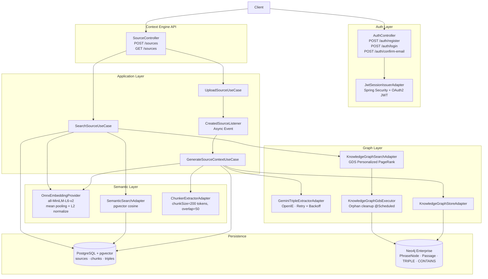

# Kairos

<a href="https://openjdk.org/"></a>
<a href="https://spring.io/projects/spring-boot"></a>
<a href="https://www.postgresql.org/"></a>
<a href="https://github.com/pgvector/pgvector"></a>
<a href="https://neo4j.com/"></a>
<a href="https://onnxruntime.ai/"></a>
<a href="https://resilience4j.readme.io/"></a>
<a href="https://www.docker.com/"></a>

You read. You take notes. You highlight things that feel important. Three weeks later you have an intuition that something connects — but you can't remember where it was, how it was phrased, or what it links to.

The problem isn't that you forgot. The problem is that the structure was never built in the first place.

**Kairos** is a JVM-native knowledge graph engine. You ingest content — notes, articles, ideas. Kairos reads it, understands it, and automatically constructs the conceptual structure behind it: a growing graph of what you know and how it connects. Retrieval is not keyword matching or naive vector similarity — it is multi-hop reasoning across the knowledge graph, surfacing connections you never consciously made.

The entire AI pipeline runs on the JVM. No Python sidecar, no external embedding service. The sentence transformer model is loaded as an ONNX file and executed directly via ONNX Runtime, with DJL handling HuggingFace tokenization. This keeps the system self-contained, deterministic, and easy to deploy.

---

## Table of Contents

- [System Design](#system-design)
- [Theoretical Foundation](#theoretical-foundation)
- [Architecture Profile](#architecture-profile)
- [Ingestion Pipeline](#ingestion-pipeline)
- [Retrieval Pipeline](#retrieval-pipeline)
- [Data Model](#data-model)
- [API Surface](#api-surface)
- [Technology Stack](#technology-stack)
- [Quick Start](#quick-start)
- [Roadmap](#roadmap)

---

## System Design

Kairos is organized into six operational concerns: authentication, source management, context generation, knowledge retrieval, semantic indexing, and graph reasoning.



The design intent is to separate **semantic proximity** (vector similarity) from **structural relevance propagation** (graph traversal), then combine both in a deterministic retrieval flow. Authentication gates every protected endpoint via stateless JWT tokens.

---

## Theoretical Foundation

Kairos is built on [HippoRAG 2](https://arxiv.org/abs/2502.14802) — a neurobiologically-motivated retrieval architecture that models the knowledge graph as an artificial hippocampal index, mirroring how the human brain consolidates and retrieves associative memory.

The domain model has been designed to accurately reflect HippoRAG's data structures: `Concept` nodes (the `PhraseNode` graph vertices), `KnowledgeTriple` records linking concepts through typed predicates, and `Passage` nodes as graph anchors keyed by `chunkId`. Each layer of the domain corresponds directly to a component in the HippoRAG retrieval graph.

### 1 · Distributional Semantics for Initial Recall

Text chunks and query strings are projected into the same 384-dimensional embedding space using `all-MiniLM-L6-v2`, executed locally on the JVM via ONNX Runtime. Embeddings are L2-normalized after inference to stabilize cosine similarity ranking across the full chunk distribution. Cosine distance (`<=>` in pgvector) with an HNSW index gives high-recall semantic anchors even when lexical overlap is weak.

Triple keys (`subject-predicate-object`) are also embedded and stored in PostgreSQL, creating a separate vector index over the extracted knowledge — a foundation for future concept-level semantic search that goes beyond chunk-level retrieval.

### 2 · Graph Diffusion for Multi-hop Expansion

Semantic anchors are local signals. Kairos treats them as seeds in the knowledge graph and runs Personalized PageRank (PPR) via Neo4j GDS, propagating relevance through connected `PhraseNode` concepts and `Passage` anchors. This enables multi-hop contextualization: a query about "weight updates" can surface a passage about "backpropagation" via "gradient descent" — without those terms appearing in the same chunk or even the same source.

GDS projections are created per request under a unique `hipporag-<uuid>` name to isolate concurrent retrievals, and are guaranteed to be released in a `finally` block. A scheduled background job cleans up projections left behind by abrupt JVM termination or pod eviction.

### 3 · Representation Alignment and Score Stability

L2 normalization after ONNX inference ensures that vector magnitude does not dominate cosine distance. PPR weights on `TRIPLE` relationships carry the semantic confidence assigned at extraction time, allowing the graph diffusion to be guided by extraction quality — not just structural connectivity.

In short: dense retrieval proposes where to start; graph diffusion determines what else is contextually relevant.

---

## Architecture Profile

Kairos is organized into bounded contexts following hexagonal architecture. Every external dependency — pgvector, Neo4j, Gemini, ONNX Runtime — is accessed through a port interface. Adapters implement the ports. The application layer orchestrates use cases without any knowledge of infrastructure.

```
auth/
  domain/
    model/    AuthenticatedSession, AuthenticatedUser, PendingUser
    policy/   PasswordPolicy
    port/     AuthenticatorPort, SessionIssuerPort, PasswordEncoderPort,
              CodeConfirmationPort, EmailConfirmationSenderPort,
              UserRegistrationPort
  application/
    use_case/ RegisterUseCase, ConfirmEmailUseCase, LoginUseCase
  infrastructure/
    security/ JwtSessionIssuerAdapter, SpringPasswordEncoderAdapter,
              UserAuthenticatorAdapter, AuthSecurityConfiguration
    email/    LoggingEmailConfirmationSenderAdapter
  presentation/
    controller/ AuthController

user/
  domain/
    model/      User, Role
    repository/ UserRepository
  infrastructure/
    persistence/ UserEntity, UserEntityMapper, UserEntityRepository

context_engine/
  domain/
    model/
      content/    Source, Chunk, TripleExtracted
      knowledge/  Concept, KnowledgeTriple, Passage
      retrieval/
        candidate/ PassageCandidate, TripleCandidate
        graph/     GraphSearchRequest, GraphSearchResult, FilteredTriple
        ranking/   RankedChunk, ScoredPassage
        seed/      GraphSeed, GraphSeedTarget, SeedType,
                   PassageSeedTarget, ConceptSeedTarget
        source/    RetrievalSource
    port/
      embedding/  EmbeddingProvider
      event/      SourceEventPublisher
      extraction/ ChunkerExtractor, TripleExtractor
      graph/      KnowledgeGraphStore, KnowledgeGraphSearch
      repository/ SourceRepository, ChunkRepository, TripleRepository
      semantic/   SemanticSearch
  application/
    use_case/   UploadSourceUseCase, GenerateSourceContextUseCase,
                SearchSourceUseCase
  infrastructure/
    ai/gemini/        GeminiRestClient (retry + backoff), GeminiResponseParser
    embedding/onnx/   OnnxEmbeddingProvider, OrtTensorFactory
    event/            CreatedSourceListener, SpringSourceEventPublisher
    extraction/       ChunkerExtractorAdapter, GeminiTripleExtractorAdapter
    graph/            KnowledgeGraphStoreAdapter, KnowledgeGraphSearchAdapter,
                      KnowledgeGraphGdsExecutor, KnowledgeGraphMutationExecutor
    relational/       PostgreSQL repositories, SemanticSearchAdapter
  presentation/
    controller/ SourceController
```

This layering allows infrastructure replacement without touching domain or application logic. Swapping Gemini for a local Ollama model, or replacing pgvector with a dedicated vector database, requires only a new adapter implementation behind the existing port contract.

---

## Ingestion Pipeline

Ingestion runs in two phases: a synchronous upload phase and an asynchronous context generation phase.

**Phase 1 — `UploadSourceUseCase` (synchronous, within the HTTP request)**

1. Persist the `Source` to PostgreSQL
2. **Chunking** — token-based sliding window (`chunkSize=200 tokens`, `overlap=50 tokens`); chunks are persisted immediately as `Chunk` rows in PostgreSQL
3. Emit `CreatedSourceEvent` and return `201 Created`

**Phase 2 — `GenerateSourceContextUseCase` (asynchronous, via `CreatedSourceListener`)**

4. `CreatedSourceListener` receives the event and invokes `GenerateSourceContextUseCase`
5. Load the source and its already-persisted chunks from PostgreSQL
6. **Chunk embedding** — each chunk embedded to `float[384]` via ONNX Runtime + DJL tokenizer; L2-normalized; stored in the `chunks.embedding vector(384)` column
7. **Triple extraction** — Gemini Flash receives each chunk and returns structured OpenIE triples (`subject → predicate → object`) via a carefully engineered prompt; wrapped in exponential-backoff retry via `@Retryable` (Resilience4j)
8. **Triple embedding** — each triple key (`subject-predicate-object`) is embedded and persisted in the `triples` table, building a concept-level vector index
9. **Graph construction** — `Passage` nodes and `PhraseNode` concepts are merged into Neo4j; `TRIPLE` and `CONTAINS` relationships carry the predicate text and extraction weight

The result is a **triple index**: semantic chunk vectors in PostgreSQL, concept embeddings in PostgreSQL, and a structural knowledge graph in Neo4j. The upload returns immediately; the AI-heavy work happens fully in the background.

---

## Retrieval Pipeline

Search executes graph-augmented retrieval in a single synchronous flow:

1. Embed the query string using the same ONNX model used at ingest time
2. Retrieve the top-10 `PassageCandidate` records from pgvector (cosine distance over chunk embeddings)
3. If no candidates are found, return an empty `SearchResult` immediately
4. Pass candidates to `KnowledgeGraphSearch.expandKnowledge` — a dedicated GDS pipeline:
   - Project a named in-memory GDS graph (`PhraseNode` nodes, `TRIPLE` edges)
   - Run Personalized PageRank seeded by the `Passage` nodes linked to the semantic anchors
   - Rank passages by their maximum propagated score; return the top-10 with their associated triples
   - Drop the GDS projection in a `finally` block (orphan cleanup via `@Scheduled` fallback)
5. Extract the ordered `chunkId` list from the ranked `KnowledgeTriple` results
6. Hydrate chunk payloads from PostgreSQL, preserving PPR rank order
7. Return a `SearchResult` containing ranked `Chunk` objects and the activated `KnowledgeTriple` graph path

Current implementation constants:

| Parameter               | Value |
|-------------------------|-------|
| Semantic anchor count   | 10    |
| PPR max iterations      | 20    |
| PPR damping factor      | 0.85  |
| Passage expansion limit | 10    |

> **In progress:** the retrieval flow is currently being extended to implement the complete HippoRAG 2 pipeline — including concept-level seeding alongside passage seeds, RRF score fusion between dense and graph-expanded candidates, and explicit `GraphSeed` construction that routes `ConceptSeedTarget` and `PassageSeedTarget` through typed PPR seeding strategies.

---

## Data Model

### PostgreSQL + pgvector

| Table     | Columns                                                                        |
|-----------|--------------------------------------------------------------------------------|
| `sources` | `id`, `title`, `content`, `status`                                             |
| `chunks`  | `id`, `source_id`, `content`, `chunk_index`, `embedding vector(384)`, `status` |
| `triples` | `id`, `key`, `subject`, `predicate`, `object`, `embedding vector(384)`, `chunk_id` |
| `users`   | `id`, `name`, `username`, `email`, `password_hash`, `role`, `status`           |

HNSW indexes are maintained on `chunks.embedding` and `triples.embedding` using the cosine operator class. The `triples.key` is the normalized `subject-predicate-object` string used as the embedding input.

### Neo4j (Enterprise + GDS)

| Element      | Description                                                                |
|--------------|----------------------------------------------------------------------------|
| `PhraseNode` | Concept node extracted from chunk content; identified by `name`            |
| `Passage`    | Chunk reference node keyed by `chunkId` (UUID); bridge to PostgreSQL       |
| `TRIPLE`     | Directed relationship between two `PhraseNode` nodes; carries `predicate` and `weight` |
| `CONTAINS`   | Directed relationship from `Passage` to each `PhraseNode` it references   |

This schema supports semantic lookup in PostgreSQL and multi-hop contextual expansion in Neo4j without cross-database joins. The `chunkId` UUID is the single bridge between both stores.

---

## API Surface

Full API documentation is available via Swagger UI at `/swagger-ui.html` when the application is running.

### Authentication — `POST /auth/register`

Registers a new user. Validates the password against the domain `PasswordPolicy`, hashes it via Spring Security Crypto, and sends an email confirmation code. Returns `201 Created`.

### Authentication — `POST /auth/confirm-email`

Confirms a pending registration using the emailed code. On success, activates the user account and returns a signed JWT access token with role claims.

### Authentication — `POST /auth/login`

Authenticates an existing user by `identifier` (username or email) and password. Returns a signed JWT access token and the user's roles.

### Sources — `POST /sources`

Ingests a new source document. Request body: `{ title, content, authorId }`.

- Synchronously persists the source and its text chunks (`chunkSize=200 tokens`, `overlap=50 tokens`), then returns `201 Created` immediately.
- A `CreatedSourceEvent` triggers background processing: chunk embedding, triple extraction via Gemini Flash, triple embedding, and knowledge graph construction in Neo4j.

### Sources — `GET /sources`

Executes graph-augmented retrieval against the knowledge base. Request body: `{ termQuery }`. Returns a `SearchResult` containing:

- **`chunks`** — text chunks ranked by PPR graph score, hydrated from PostgreSQL
- **`knowledgeTriples`** — the activated knowledge graph path (`subject → predicate → object`) that explains why each chunk was selected

---

## Technology Stack

| Concern                 | Implementation                                                            |
|-------------------------|---------------------------------------------------------------------------|
| Language / runtime      | Java 21 · Virtual Threads (JVM-native, no Python sidecar)                 |
| Application framework   | Spring Boot 4.0.5 · Spring MVC · Spring Data JPA · Spring Data Neo4j      |
| Security                | Spring Security · OAuth2 Resource Server · JWT (Nimbus JOSE)              |
| Resilience              | Resilience4j 2.3.0 · `@Retryable` with exponential backoff               |
| Embedding model         | ONNX Runtime 1.20.0 · `all-MiniLM-L6-v2` (384 dimensions) · runs on JVM  |
| Tokenizer               | DJL HuggingFace Tokenizers (JNI — no Python runtime required)             |
| Vector store            | PostgreSQL 16 · pgvector extension · HNSW index (cosine)                  |
| Graph store             | Neo4j 5.19 Enterprise · GDS plugin (Personalized PageRank)                |
| Triple extraction       | Gemini Flash · prompt-engineered OpenIE · port-isolated; swappable        |
| Validation              | Bean Validation (Jakarta) · domain-level policy objects                   |
| Infrastructure          | Docker Compose · health-checked service dependencies                      |

The embedding pipeline has zero external service dependencies. `all-MiniLM-L6-v2` is loaded as an ONNX model file at startup; tokenization runs via DJL's JNI bindings to the HuggingFace tokenizer library. Mean pooling and L2 normalization are computed in plain Java. The entire inference path runs inside the JVM process.

---

## Quick Start

### Prerequisites

- Docker + Docker Compose
- Java 21 (for local Maven build only)

### 1. Configure environment

```bash
cp .env.example .env
```

Edit `.env` and set the required variables:

| Variable            | Description                                                                         |
|---------------------|-------------------------------------------------------------------------------------|
| `POSTGRES_PASSWORD` | Password for the PostgreSQL instance                                                |
| `NEO4J_PASSWORD`    | Password for the Neo4j instance                                                     |
| `GEMINI_API_KEY`    | Gemini API key for triple extraction ([get one free](https://aistudio.google.com/)) |
| `GEMINI_MODEL`      | Gemini model name (e.g. `gemini-1.5-flash`)                                         |
| `POSTGRES_DB`       | Database name (default: `kairos`)                                                   |

### 2. Start the stack

```bash
docker compose up --build
```

### 3. Validate infrastructure

```bash
./infra/validate-infra.sh
```

### 4. Explore the API

Navigate to `http://localhost:8080/swagger-ui.html` for interactive API documentation.

---

## Roadmap

| Area                    | Status       | Goal                                                                                                                       |
|-------------------------|--------------|----------------------------------------------------------------------------------------------------------------------------|
| Retrieval pipeline      | 🔄 In progress | Complete HippoRAG 2 flow: concept-level graph seeding, `GraphSeed` routing (`PassageSeedTarget` + `ConceptSeedTarget`), RRF score fusion between dense and graph-expanded candidates |
| Triple semantic search  | 🔄 In progress | Use `triples.embedding` to seed PPR at the concept level, not just at the passage level — enabling finer-grained graph anchoring |
| Structural learning     | 📋 Planned   | Edge weight reinforcement via co-activation — concepts that consistently appear together accumulate stronger `TRIPLE` weights over time |
| Graph quality           | 📋 Planned   | Synonym consolidation via embedding similarity — automatically linking `backprop` to `backpropagation` without manual normalization |
| Explainability          | 📋 Planned   | Expose retrieval traces: which anchors were selected, PPR scores, what determined final chunk ordering |
| Email delivery          | 📋 Planned   | Replace `LoggingEmailConfirmationSenderAdapter` with a real SMTP / transactional email adapter |
| Frontend                | 📋 Planned   | Graph View (D3.js force-directed), Source View, Semantic Search UI                                                         |
| Operations              | 📋 Planned   | Observability (Micrometer/Actuator), controlled reindex, and backfill workflows                                            |

---

Built by [Lucas Eckert](https://luca5eckert.github.io)
