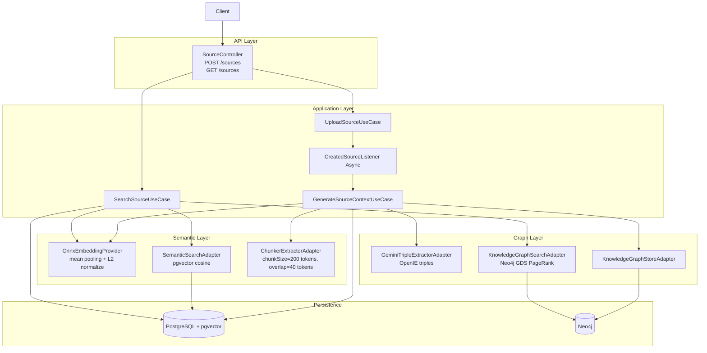

# Kairos

<a href="https://openjdk.org/"></a>
<a href="https://spring.io/projects/spring-boot"></a>
<a href="https://www.postgresql.org/"></a>
<a href="https://github.com/pgvector/pgvector"></a>
<a href="https://neo4j.com/"></a>
<a href="https://onnxruntime.ai/"></a>
<a href="https://www.docker.com/"></a>

You read. You take notes. You highlight things that feel important. Three weeks later you have an intuition that something connects — but you can't remember where it was, how it was phrased, or what it actually links to.

The problem isn't that you forgot. The problem is that the structure was never built in the first place.

**Kairos** is a JVM-native knowledge graph engine. You ingest content — notes, articles, ideas. Kairos reads it, understands it, and automatically constructs the conceptual structure behind it: a growing graph of what you know and how it connects. Retrieval is not keyword matching or naive vector similarity — it is multi-hop reasoning across the knowledge graph, surfacing connections you never consciously made.

---

## Table of Contents

- [System Design](#system-design)
- [Theoretical Foundation](#theoretical-foundation)
- [Architecture Profile](#architecture-profile)
- [Ingestion Pipeline](#ingestion-pipeline)
- [Retrieval Pipeline](#retrieval-pipeline)
- [Data Model](#data-model)
- [API Surface](#api-surface)
- [Technology Stack](#technology-stack)
- [Quick Start](#quick-start)
- [Roadmap](#roadmap)

---

## System Design

Kairos is organized into five operational layers: API, application orchestration, semantic representation, graph reasoning, and persistence.



The design intent is to separate **semantic proximity** (vector similarity) from **structural relevance propagation** (graph traversal), then combine both in a deterministic retrieval flow.

---

## Theoretical Foundation

Kairos is based on three retrieval principles, inspired by [HippoRAG 2](https://arxiv.org/abs/2502.14802) (NeurIPS 2024) — a neurobiologically-motivated retrieval framework that treats the knowledge graph as an artificial hippocampal index.

### 1) Distributional Semantics for Initial Recall

Text chunks and queries are projected into the same 384-dimensional embedding space using `all-MiniLM-L6-v2`, running locally on the JVM via ONNX Runtime. Similarity is measured with cosine distance (`<=>` in pgvector), giving high-recall semantic anchors even when lexical overlap is weak.

### 2) Graph Diffusion for Multi-hop Expansion

Anchors alone are local signals. Kairos treats them as seeds in a knowledge graph and applies Personalized PageRank (PPR) via Neo4j GDS, propagating relevance through connected concepts and passages. This enables multi-hop contextualization: a query about "weight updates" can surface a passage about "backpropagation" via "gradient descent" — without any of those terms appearing in the same chunk.

### 3) Representation Alignment and Score Stability

Embeddings are L2-normalized after ONNX inference. Normalization keeps vector magnitude from dominating cosine distance and stabilizes ranking behavior across chunk and query distributions.

In short: dense retrieval proposes where to start, graph diffusion determines what else is contextually important.

---

## Architecture Profile

Kairos follows hexagonal architecture. Every external dependency — pgvector, Neo4j, Gemini, the ONNX model — is accessed through a port interface. Adapters implement the ports. The application layer orchestrates use cases without knowing about infrastructure.

```
domain/
  model/      Source, Chunk, KnowledgeTriple, SearchResult
  port/
    embedding/  EmbeddingProvider
    event/      SourceEventPublisher
    extraction/ ChunkerExtractor, TripleExtractor
    graph/      KnowledgeGraphStore, KnowledgeGraphSearch
    repository/ SourceRepository, ChunkRepository
    semantic/   SemanticSearch

application/
  use_case/   UploadSourceUseCase, GenerateSourceContextUseCase,
              SearchSourceUseCase

infrastructure/
  ai/gemini/            GeminiTripleExtractorAdapter
  embedding/onnx/       OnnxEmbeddingProvider
  event/                CreatedSourceListener, SpringSourceEventPublisher
  extraction/           ChunkerExtractorAdapter, GeminiTripleExtractorAdapter
  graph/neo4j/          KnowledgeGraphStoreAdapter, KnowledgeGraphSearchAdapter
  relational/           PostgreSQL repositories, pgvector semantic search

presentation/
  controller/ SourceController
```

This allows infrastructure replacement — for example, swapping Gemini for a local Ollama model — without touching domain or application logic.

---

## Ingestion Pipeline

Ingestion is asynchronous and event-driven inside the service boundary.

1. `POST /sources` persists a new source and emits `CreatedSourceEvent`
2. `CreatedSourceListener` consumes the event asynchronously
3. `GenerateSourceContextUseCase` runs the full context generation flow:
   - Token-based chunking (`chunkSize=200 tokens`, `overlap=40 tokens`)
   - Embedding generation per chunk (ONNX Runtime + DJL HuggingFace Tokenizers)
   - Chunk persistence in PostgreSQL with `vector(384)` column
   - Knowledge triple extraction per chunk via Gemini Flash (Open Information Extraction)
   - Graph persistence in Neo4j (`PhraseNode`, `Passage`, `TRIPLE`, `CONTAINS` edges)

The resulting state forms a **dual index**: a vector index for semantic recall and a graph index for relational expansion. Both are built from the same ingestion pass — no separate indexing step is required.

PostgreSQL stores `chunk_index` (position of the chunk within the source: `0, 1, 2, ...`). Neo4j stores `chunkId` (the UUID identity of that chunk) for cross-layer linkage during retrieval hydration.

---

## Retrieval Pipeline

Search executes graph-augmented retrieval in a single synchronous flow:

1. Embed the query text using the same ONNX model used at ingest time
2. Retrieve the top-10 semantically similar chunks from pgvector (cosine distance)
3. Resolve the `PhraseNode` graph nodes linked to those anchor chunks
4. Run Personalized PageRank in Neo4j GDS, seeded by the anchor nodes
5. Rank `Passage` nodes by propagated PPR relevance score
6. Hydrate the ordered chunk payloads from PostgreSQL
7. Return a `SearchResult` containing the ranked chunks and the activated knowledge triples

Current implementation constants:

| Parameter               | Value |
|-------------------------|-------|
| Anchor count            | 10    |
| PPR max iterations      | 20    |
| PPR damping factor      | 0.85  |
| Passage expansion limit | 10    |

---

## Data Model

### PostgreSQL + pgvector

| Table     | Columns                                                              |
|-----------|----------------------------------------------------------------------|
| `sources` | `id`, `title`, `content`, `status`                                   |
| `chunks`  | `id`, `source_id`, `content`, `chunk_index`, `embedding vector(384)` |

An HNSW index is created on `chunks.embedding` using the cosine operator class for approximate nearest-neighbor search.

### Neo4j

| Element      | Description                                                             |
|--------------|-------------------------------------------------------------------------|
| `PhraseNode` | Concept nodes extracted from content                                    |
| `Passage`    | Chunk references, keyed by `chunkId` (UUID)                             |
| `TRIPLE`     | Relationships between phrase nodes, carrying `predicate` and `chunk_id` |
| `CONTAINS`   | Edges from `Passage` nodes to their associated `PhraseNode` concepts    |

This schema supports semantic lookup in PostgreSQL and contextual expansion in Neo4j without cross-database joins. The `chunkId` UUID is the bridge between both stores.

---

## API Surface

Full API documentation is available via Swagger UI at `/swagger-ui.html` when the application is running.

### `POST /sources`

Ingests a new source. Persists the content and triggers asynchronous context generation — chunking, embedding, triple extraction, and graph construction run in the background. Returns `201 Created` immediately.

### `GET /sources`

Executes hybrid retrieval against the knowledge base. Returns a `SearchResult` containing:

- **`chunks`** — ranked list of the most contextually relevant text chunks from ingested sources
- **`knowledgeTriples`** — the knowledge graph triples activated during PPR propagation, exposing the conceptual reasoning path behind the result

---

## Technology Stack

| Concern               | Implementation                                          |
|-----------------------|---------------------------------------------------------|
| Language / runtime    | Java 21 · Virtual Threads                               |
| Application framework | Spring Boot 4.0.5 · WebFlux                             |
| Embedding model       | ONNX Runtime 1.20.0 · all-MiniLM-L6-v2 (384 dimensions) |
| Tokenizer             | DJL HuggingFace Tokenizers                              |
| Vector store          | PostgreSQL 16 · pgvector · HNSW index                   |
| Graph store           | Neo4j 5.19 · GDS (Personalized PageRank)                |
| Triple extraction     | Gemini Flash — isolated behind a port; swappable        |
| Infrastructure        | Docker Compose                                          |

No ML framework wrappers. The embedding pipeline runs directly on the JVM via ONNX Runtime — the model is a file, not a service.

---

## Quick Start

### Prerequisites

- Docker + Docker Compose
- Java 21 (for local Maven build only)

### 1. Configure environment

```bash
cp .env.example .env
```

Edit `.env` and set the required variables:

| Variable            | Description                                                                         |
|---------------------|-------------------------------------------------------------------------------------|
| `POSTGRES_PASSWORD` | Password for the PostgreSQL instance                                                |
| `NEO4J_PASSWORD`    | Password for the Neo4j instance                                                     |
| `GEMINI_API_KEY`    | Gemini API key for triple extraction ([get one free](https://aistudio.google.com/)) |
| `POSTGRES_DB`       | Database name (default: `kairos`)                                                   |
| `NEO4J_URI`         | Neo4j bolt URI (default: `bolt://localhost:7687`)                                   |

### 2. Start the stack

```bash
docker compose up --build
```

### 3. Validate infrastructure

```bash
./infra/validate-infra.sh
```

### 4. Explore the API

Navigate to `http://localhost:8080/swagger-ui.html` for interactive API documentation.

---

## Roadmap

| Area                | Goal                                                                                                                                                               |
|---------------------|--------------------------------------------------------------------------------------------------------------------------------------------------------------------|
| Retrieval fusion    | RRF fusion between dense candidates and graph-expanded candidates (HippoRAG 2 full pipeline)                                                                       |
| Structural learning | Edge weight reinforcement via co-activation and co-definition — concepts that consistently appear together accumulate stronger graph edges over time (see ADR-004) |
| Graph quality       | Synonym consolidation via embedding similarity — automatically linking `backprop` to `backpropagation` without manual normalization                                |
| Explainability      | Expose retrieval traces: which anchors were selected, how PPR scored them, what determined final ordering                                                          |
| Frontend            | Graph View (D3.js force-directed), Source View, Semantic Search UI                                                                                                 |
| Operations          | Observability, controlled reindex, and backfill workflows                                                                                                          |

---

Built by [Lucas Eckert](https://luca5eckert.github.io)
