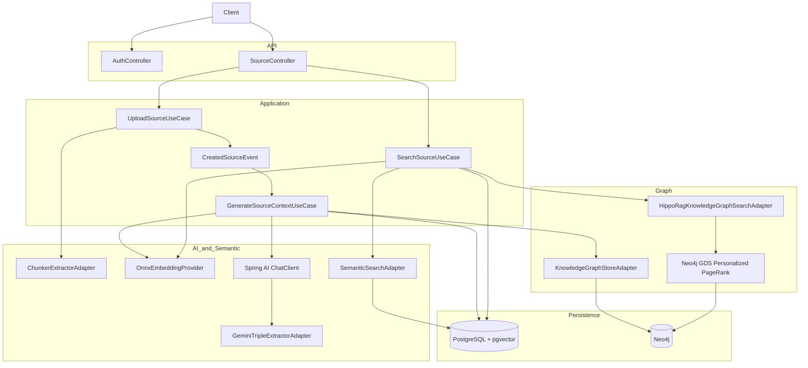

# Kairos

<a href="https://openjdk.org/"></a>
<a href="https://spring.io/projects/spring-boot"></a>
<a href="https://spring.io/projects/spring-ai"></a>
<a href="https://www.postgresql.org/"></a>
<a href="https://github.com/pgvector/pgvector"></a>
<a href="https://neo4j.com/"></a>
<a href="https://onnxruntime.ai/"></a>
<a href="https://www.docker.com/"></a>

> *Kairos* (καιρός) — the ancient Greek concept of the opportune moment. The right knowledge, retrieved at the right time.

**Standard RAG finds similar text. Kairos understands what it read.**

Most retrieval systems stop at vector similarity — they return passages that look alike, not passages that *mean* something together. Kairos goes further: it extracts concepts, builds a knowledge graph from source material, and uses graph traversal to surface context that is semantically connected even when the exact same words never appear in the same passage.

The result is a retrieval engine that reasons about relationships, not just proximity.

## Contents

- [How It Works](#how-it-works)
- [Architecture](#architecture)
- [Ingestion Flow](#ingestion-flow)
- [Retrieval Flow](#retrieval-flow)
- [Data Model](#data-model)
- [API](#api)
- [Quick Start](#quick-start)
- [Try It in 5 Minutes](#try-it-in-5-minutes)
- [Spring AI Integration](#spring-ai-integration)
- [What Is Already Built](#what-is-already-built)
- [Known Limitations](#known-limitations)
- [Roadmap](#roadmap)
- [Technology Stack](#technology-stack)

## How It Works

When a source document is ingested, Kairos builds three things in parallel: a durable chunk store in PostgreSQL, a vector index in pgvector for semantic recall, and a knowledge graph in Neo4j that maps the concepts and relationships extracted from the text.

At query time, dense retrieval identifies the most relevant starting points. The knowledge graph then expands outward — activating connected concepts, related passages, and extracted facts that a pure vector search would miss. The two signals are combined into a single ranked response.

The entire pipeline runs JVM-native. Embeddings are generated in-process via ONNX Runtime, with no external embedding service required. Triple extraction is the only step that calls an LLM — handled by Gemini through Spring AI, behind a domain port that can be swapped without touching the retrieval logic.

## Architecture


```mermaid
graph TB
    C[Client]

    subgraph API
      AC[AuthController]
      SC[SourceController]
    end

    subgraph Application
      US[UploadSourceUseCase]
      GS[GenerateSourceContextUseCase]
      SS[SearchSourceUseCase]
      EV[CreatedSourceEvent]
    end

    subgraph AI_and_Semantic
      CH[ChunkerExtractorAdapter]
      EM[OnnxEmbeddingProvider]
      AI[Spring AI ChatClient]
      TX[GeminiTripleExtractorAdapter]
      VS[SemanticSearchAdapter]
    end

    subgraph Graph
      KG[KnowledgeGraphStoreAdapter]
      KS[HippoRagKnowledgeGraphSearchAdapter]
      GDS[Neo4j GDS Personalized PageRank]
    end

    subgraph Persistence
      PG[(PostgreSQL + pgvector)]
      NEO[(Neo4j)]
    end

    C --> AC
    C --> SC
    SC --> US
    US --> CH
    US --> EV
    EV --> GS
    GS --> EM
    GS --> AI
    AI --> TX
    GS --> PG
    GS --> KG
    KG --> NEO
    SC --> SS
    SS --> EM
    SS --> VS
    VS --> PG
    SS --> KS
    KS --> GDS
    GDS --> NEO
    SS --> PG
```

The codebase follows a hexagonal architecture:

- `domain` — business models and ports, with no framework dependencies.
- `application` — use cases, commands, and queries.
- `infrastructure` — adapters for PostgreSQL, Neo4j, ONNX Runtime, Spring AI/Gemini, events, and security.
- `presentation` — controllers, request/response DTOs, and mappers.

## Ingestion Flow

`POST /sources` triggers the full knowledge-building pipeline.

1. Persist the source document in PostgreSQL.
2. Split content into token-bounded semantic chunks.
3. Persist chunks immediately for durability.
4. Publish `CreatedSourceEvent` to kick off async enrichment.
5. Embed each chunk locally using ONNX Runtime.
6. Extract factual subject-predicate-object triples via Spring AI + Gemini.
7. Embed each triple key for semantic triple search.
8. Persist triples in PostgreSQL.
9. Merge passages, concepts, `TRIPLE`, and `CONTAINS` relationships into Neo4j.

## Retrieval Flow

`GET /sources` accepts a `termQuery` and returns graph-augmented context.

1. Embed the query using the same local ONNX model as ingestion.
2. Retrieve semantically similar chunks from pgvector.
3. Promote top hits to graph seed nodes.
4. Run Personalized PageRank via Neo4j GDS, propagating importance through connected concepts.
5. Rank passages using the combined semantic and graph scores.
6. Rehydrate chunk text from PostgreSQL.
7. Return ranked chunks alongside the activated knowledge triples.

Current retrieval defaults:

| Parameter | Default | Effect |
| --- | --- | --- |
| `KAIROS_SEMANTIC_ANCHOR_LIMIT` | `10` | Number of vector hits used as graph seeds |
| `KAIROS_GRAPH_PASSAGE_LIMIT` | `20` | Maximum passages returned after graph expansion |
| `KAIROS_SEED_MIN_SCORE` | `0.45` | Minimum similarity score to qualify as a seed |
| `KAIROS_SEED_RELATIVE_THRESHOLD` | `0.85` | Seeds must score within this fraction of the top hit |

## Data Model

PostgreSQL holds the relational core: `sources` store the original documents, `chunks` hold the split content with their `embedding vector(384)` and processing `status`, `triples` persist each extracted subject-predicate-object fact alongside its own embedding, and `users` covers auth with roles and statuses.

Neo4j holds the semantic graph. Every chunk becomes a `Passage` node. Every concept extracted from that chunk becomes a `PhraseNode`. A `TRIPLE` edge connects two concepts with a directed relationship, and a `CONTAINS` edge links a passage to each concept it mentions. Graph traversal during retrieval walks these edges to find what is meaningfully related, not just textually similar.

## API

Interactive API documentation is available at:

```
http://localhost:8080/swagger-ui.html
```

### Auth

| Method | Path | Description |
| --- | --- | --- |
| `POST` | `/auth/register` | Creates a pending user and issues an email confirmation code |
| `POST` | `/auth/confirm-email` | Confirms the user and returns a signed JWT |
| `POST` | `/auth/login` | Authenticates by username or email and returns a JWT |

### Sources

| Method | Path | Body | Description |
| --- | --- | --- | --- |
| `POST` | `/sources` | `{ "title", "content", "authorId" }` | Ingests a source and starts async knowledge graph construction |
| `GET` | `/sources` | `{ "termQuery" }` | Queries the knowledge base and returns graph-augmented context |

Response shape:

```json
{
  "knowledgeGraph": [
    {
      "subject": "retrieval augmented generation",
      "predicate": "COMBINES",
      "object": "retrieval and generation",
      "chunkId": "00000000-0000-0000-0000-000000000000"
    }
  ],
  "chunkContexts": [
    {
      "chunkId": "00000000-0000-0000-0000-000000000000",
      "content": "...",
      "rank": 1,
      "score": 0.87,
      "source": "GRAPH"
    }
  ]
}
```

## Quick Start

### Prerequisites

- Docker and Docker Compose
- Java 21 (only required if running Maven locally outside Docker)
- A Gemini API key

### 1. Configure environment

```bash
cp .env.example .env
```

Set at minimum:

```env
POSTGRES_PASSWORD=change-me
NEO4J_PASSWORD=change-me
GEMINI_API_KEY=your-gemini-api-key
KAIROS_LLM_MODEL=gemini-2.5-flash
KAIROS_LLM_TEMPERATURE=0.0
KAIROS_LLM_MAX_OUTPUT_TOKENS=4096
AUTH_SESSION_SECRET=change-me-to-a-long-random-secret
```

### 2. Start the stack

```bash
docker compose up --build
```

### 3. Verify health

```bash
curl http://localhost:8080/actuator/health
```

### 4. Run tests

```bash
./mvnw.cmd test
```

## Try It in 5 Minutes

### 1. Ingest a source

```bash
curl -X POST http://localhost:8080/sources \
  -H "Content-Type: application/json" \
  -d '{
    "title": "RAG and knowledge graphs",
    "authorId": "11111111-1111-1111-1111-111111111111",
    "content": "Retrieval augmented generation combines a retriever with a language model. The retriever finds relevant passages before the model generates an answer. Knowledge graphs improve retrieval by representing entities and relationships explicitly. A graph can connect neural networks, gradient descent, embeddings, and semantic search even when the exact same words do not appear in every passage. Personalized PageRank can start from relevant passages and propagate importance through connected concepts."
  }'
```

Returns `201 Created`. Knowledge graph construction runs asynchronously — wait a few seconds before querying.

### 2. Query the knowledge base

```bash
curl -X GET http://localhost:8080/sources \
  -H "Content-Type: application/json" \
  -d '{ "termQuery": "How can a knowledge graph improve retrieval augmented generation?" }'
```

Other queries worth trying:

```json
{ "termQuery": "What connects embeddings with semantic search?" }
{ "termQuery": "Why is Personalized PageRank useful for context retrieval?" }
{ "termQuery": "How does graph retrieval find related concepts across passages?" }
```

## Spring AI Integration

Kairos uses Spring AI as the LLM abstraction layer. Triple extraction is the only LLM-dependent step; everything else — chunking, embedding, graph construction, and retrieval — runs locally.

Relevant dependency:

```xml
<dependency>
    <groupId>org.springframework.ai</groupId>
    <artifactId>spring-ai-starter-model-google-genai</artifactId>
</dependency>
```

Configuration:

```yaml
spring:
  ai:
    model:
      chat: google-genai
    google:
      genai:
        api-key: ${GEMINI_API_KEY}
        chat:
          options:
            model: ${KAIROS_LLM_MODEL:gemini-2.5-flash}
            temperature: ${KAIROS_LLM_TEMPERATURE:0.0}
            max-output-tokens: ${KAIROS_LLM_MAX_OUTPUT_TOKENS:4096}
```

A dedicated `ChatClient` bean handles triple extraction with a fixed system prompt:

```java
@Bean
ChatClient tripleExtractionChatClient(ChatClient.Builder builder) {
    return builder
            .defaultSystem("""
                    You are an information extraction engine.
                    Extract factual subject-predicate-object triples from the user's text.
                    Do not invent facts.
                    Return only information supported by the input.
                    """)
            .build();
}
```

`GeminiTripleExtractorAdapter` calls that client with native structured output:

```java
TripleExtractionResult result = chatClient.prompt()
        .advisors(AdvisorParams.ENABLE_NATIVE_STRUCTURED_OUTPUT)
        .user(user -> user.text(PROMPT).param("text", text))
        .call()
        .entity(TripleExtractionResult.class);
```

The LLM is hidden behind the `TripleExtractor` domain port. Swapping Gemini for another model requires no changes to the application or retrieval layers.

## What Is Already Built

**Ingestion**
- Token-bounded chunking with durable persistence
- Local embedding generation via ONNX Runtime (no external service)
- Factual triple extraction via Spring AI + Gemini
- Triple embedding and vector storage in pgvector
- Knowledge graph construction in Neo4j

**Retrieval**
- Semantic anchor search with pgvector
- Graph seed promotion and Personalized PageRank expansion
- Graph-aware passage scoring and ranking
- Response hydration from PostgreSQL chunks

**Auth and users**
- Registration with email confirmation
- JWT-based authentication
- User roles and status management

**Infrastructure**
- Full Docker Compose stack for local development
- Spring Boot Actuator health endpoint

## Known Limitations

- **Authentication is not enforced on `/sources`** in the current build. This is intentional for local development. Do not expose the service publicly without securing these routes.
- **Context generation is asynchronous.** `POST /sources` returns `201` immediately; allow a few seconds before querying.
- **Failed chunks are not automatically retried.** A chunk that fails during embedding or triple extraction requires re-uploading the source. Tracked in [#52](https://github.com/Luca5Eckert/Kairos/issues/52).

## Roadmap

The core graph-augmented retrieval pipeline is fully operational. Upcoming work focuses on retrieval quality, resilience, and production-readiness.

Two tracks are already in progress: refining the retrieval flow toward a complete HippoRAG 2.0-style pipeline ([#50](https://github.com/Luca5Eckert/Kairos/issues/50)) and improving passage-aware weighted Personalized PageRank ([#41](https://github.com/Luca5Eckert/Kairos/issues/41)).

Next in line: automatic retry for failed chunks without re-uploading the source ([#52](https://github.com/Luca5Eckert/Kairos/issues/52)), stronger triple recall and recognition-memory filtering ([#40](https://github.com/Luca5Eckert/Kairos/issues/40)), expanding the user module beyond auth ([#31](https://github.com/Luca5Eckert/Kairos/issues/31)), and persisting question/answer history and retrieval traces for explainability ([#25](https://github.com/Luca5Eckert/Kairos/issues/25)).

## Technology Stack

| Concern | Implementation |
| --- | --- |
| Runtime | Java 21 |
| Framework | Spring Boot 4.0.5 |
| LLM integration | Spring AI 2.0.0-M6 + Google GenAI |
| LLM model | Gemini (`gemini-2.5-flash` by default) |
| Embeddings | ONNX Runtime + `all-MiniLM-L6-v2` (runs in-process, no external service) |
| Vector search | PostgreSQL 16 + pgvector |
| Graph search | Neo4j 5.26 + Graph Data Science |
| Security | Spring Security + JWT |
| Infrastructure | Docker Compose |

---

Built by [Lucas Eckert](https://luca5eckert.github.io)
