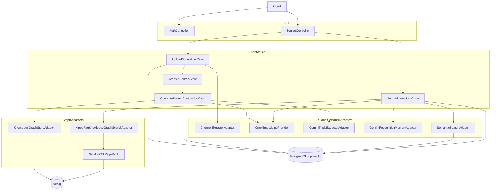
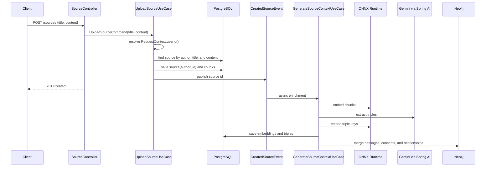
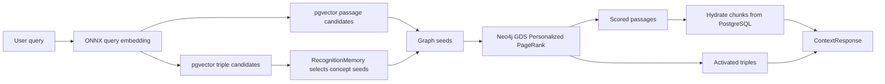

# Kairos

<a href="https://openjdk.org/"></a>
<a href="https://spring.io/projects/spring-boot"></a>
<a href="https://spring.io/projects/spring-ai"></a>
<a href="https://www.postgresql.org/"></a>
<a href="https://github.com/pgvector/pgvector"></a>
<a href="https://neo4j.com/"></a>
<a href="https://onnxruntime.ai/"></a>
<a href="https://www.docker.com/"></a>


**Standard RAG retrieves similar passages. Kairos retrieves connected knowledge.**

Kairos is a JVM-native personal knowledge graph engine for graph-augmented retrieval. It ingests source material, splits it into durable chunks, extracts factual subject-predicate-object triples, embeds both passages and triples, and uses PostgreSQL/pgvector plus Neo4j Graph Data Science to retrieve context by meaning and relationship structure.

It is built as a retrieval backend for personal knowledge systems: the user feeds sources, and Kairos builds the semantic structure needed to recover related ideas later.

## Contents

- [Why Kairos Exists](#why-kairos-exists)
- [Architecture](#architecture)
- [Ingestion Flow](#ingestion-flow)
- [Retrieval Flow](#retrieval-flow)
- [Quick Start](#quick-start)
- [Known Limitations](#known-limitations)
- [Roadmap](#roadmap)
- [Research And Technical References](#research-and-technical-references)

## At A Glance

| Dimension | Kairos today |
| --- | --- |
| Project type | JVM-native graph-augmented retrieval backend |
| Core idea | Automatic personal knowledge graph construction from ingested sources |
| Retrieval model | HippoRAG 2-inspired passage recall + triple recall + recognition memory + Personalized PageRank |
| Semantic store | PostgreSQL 16 with pgvector and HNSW indexes |
| Graph store | Neo4j 5.26 with Graph Data Science |
| Embeddings | Local ONNX Runtime inference with `all-MiniLM-L6-v2`, no Python sidecar |
| LLM boundary | Gemini via Spring AI, limited to triple extraction and recognition-memory seed selection |
| Quality snapshot | 237 tests passing, 7 skipped, 86,77% line coverage |

## Why Kairos Exists

Personal knowledge tools usually depend on manual structure: tags, folders, backlinks, graph links, aliases, and discipline. Kairos is built around a different product idea:

> Feed the system sources. Let the graph build itself.

The goal is not to be a note editor or a chatbot. Kairos is a retrieval engine that turns raw content into an expanding conceptual graph, then uses that graph to surface context the user may not have explicitly connected.

## Why Not Just Vector Search

Vector search is excellent at finding passages close to a query embedding. It is weaker when the answer depends on relationships spread across passages, concepts, or facts that do not share the same surface wording.

| Standard vector RAG | Kairos |
| --- | --- |
| Retrieves chunks by embedding proximity | Retrieves passages, triples, and graph-expanded context |
| Treats each chunk mostly independently | Connects chunks through extracted concepts and relationships |
| Usually returns text that looks semantically similar | Can activate passages connected through graph structure |
| LLM often carries most reasoning burden at answer time | Retrieval exposes relationship evidence before answer generation |
| Embedding service is often external | Embeddings run locally in-process on the JVM |

## Current State

Kairos is an operational V1 retrieval backend. The graph-augmented ingestion and search path is implemented, while product-facing graph views, source status APIs, retry workflows, and persisted retrieval traces are still roadmap work.

| Area | Current implementation |
| --- | --- |
| Ingestion | `POST /sources` accepts source content, resolves the authenticated author in the use case, stores the source, chunks content, persists chunks, and publishes `CreatedSourceEvent` for async enrichment |
| Embeddings | In-process ONNX Runtime with `all-MiniLM-L6-v2`, producing `vector(384)` embeddings |
| Triple extraction | Gemini through Spring AI `ChatClient` with native structured output |
| Semantic storage | PostgreSQL 16 with pgvector for passage and triple vector search |
| Graph storage | Neo4j 5.26 with `Passage`, `PhraseNode`, `CONTAINS`, and `TRIPLE` graph projection |
| Retrieval | User-scoped dense passage recall + triple recall + recognition memory + Neo4j GDS Personalized PageRank |
| Auth | Registration, email confirmation, login, JWT issuance, roles, request context, and protected source routes |
| Local infrastructure | Docker Compose services for `postgres`, `neo4j`, and `kairos` |

## Architecture

Kairos follows a hexagonal architecture:

| Layer | Responsibility |
| --- | --- |
| `domain` | Business models and ports with no framework dependency |
| `application` | Use cases, commands, queries, and orchestration |
| `infrastructure` | PostgreSQL, Neo4j, ONNX Runtime, Spring AI/Gemini, email, security, and event adapters |
| `presentation` | Controllers, request DTOs, response DTOs, and mappers |


```mermaid
flowchart TB
    client["Client"]

    subgraph api["API"]
        auth["AuthController"]
        sources["SourceController"]
    end

    subgraph app["Application"]
        upload["UploadSourceUseCase"]
        enrich["GenerateSourceContextUseCase"]
        search["SearchSourceUseCase"]
        event["CreatedSourceEvent"]
    end

    subgraph ai["AI and Semantic Adapters"]
        chunker["ChunkerExtractorAdapter"]
        embedder["OnnxEmbeddingProvider"]
        extractor["GeminiTripleExtractorAdapter"]
        recognition["GeminiRecognitionMemoryAdapter"]
        semantic["SemanticSearchAdapter"]
    end

    subgraph graph["Graph Adapters"]
        graphStore["KnowledgeGraphStoreAdapter"]
        graphSearch["HippoRagKnowledgeGraphSearchAdapter"]
        gds["Neo4j GDS PageRank"]
    end

    postgres[("PostgreSQL + pgvector")]
    neo4j[("Neo4j")]

    client --> auth
    client --> sources
    sources --> upload
    upload --> chunker
    upload --> postgres
    upload --> event
    event --> enrich
    enrich --> embedder
    enrich --> extractor
    enrich --> postgres
    enrich --> graphStore
    graphStore --> neo4j
    sources --> search
    search --> embedder
    search --> semantic
    search --> recognition
    semantic --> postgres
    search --> graphSearch
    graphSearch --> gds
    gds --> neo4j
    search --> postgres
```

The split is intentional:

- PostgreSQL is the textual and semantic source of truth.
- pgvector handles dense similarity over stored embeddings.
- Neo4j stores the structural graph projection.
- Neo4j GDS runs graph propagation.
- Gemini is constrained to extraction and recognition decisions, behind domain ports.
- The embedding model runs locally on the JVM, with no Python sidecar.
- Authenticated request identity is exposed through `com.kairos.share.security.context`; source ownership is resolved in the application use case, not from client-submitted ids.

## Ingestion Flow

`POST /sources` starts the knowledge-building pipeline.

1. Accept only source `title` and `content` from the request body.
2. Resolve the authenticated author inside `UploadSourceUseCase` through `RequestContextProvider`.
3. Return an existing source when the same authenticated author, title, and content were already ingested.
4. Create and persist a `Source` with `author_id` in PostgreSQL.
5. Split source content into overlapping chunks.
6. Persist chunks immediately for durability.
7. Publish `CreatedSourceEvent`.
8. Enrich unprocessed chunks asynchronously.
9. Embed each chunk with ONNX Runtime.
10. Extract factual triples with Gemini through Spring AI.
11. Embed each triple key for triple-level recall.
12. Store extracted triples and embeddings in PostgreSQL.
13. Merge user-scoped `Passage` nodes, `PhraseNode` concepts, `CONTAINS` edges, and `TRIPLE` edges into Neo4j.
14. Mark processed chunks as complete.


```mermaid
sequenceDiagram
    participant C as Client
    participant API as SourceController
    participant U as UploadSourceUseCase
    participant PG as PostgreSQL
    participant E as CreatedSourceEvent
    participant G as GenerateSourceContextUseCase
    participant ORT as ONNX Runtime
    participant LLM as Gemini via Spring AI
    participant NEO as Neo4j

    C->>API: POST /sources {title, content}
    API->>U: UploadSourceCommand(title, content)
    U->>U: resolve RequestContext.userId()
    U->>PG: find source by author, title, and content
    U->>PG: save source(author_id) and chunks
    U->>E: publish source id
    API-->>C: 201 Created
    E->>G: async enrichment
    G->>ORT: embed chunks
    G->>LLM: extract triples
    G->>ORT: embed triple keys
    G->>PG: save embeddings and triples
    G->>NEO: merge passages, concepts, and relationships
```

## Retrieval Flow

`POST /sources/search` accepts a `termQuery` and returns ranked chunks plus activated triples.

The current search path reflects the newer HippoRAG 2-style flow implemented in [PR #59](https://github.com/Luca5Eckert/Kairos/pull/59):

1. Resolve the authenticated user from `RequestContextProvider`.
2. Embed the user query with the same ONNX model used during ingestion.
3. Retrieve passage candidates from pgvector using cosine similarity, filtered by `sources.author_id`.
4. Retrieve triple candidates from pgvector using triple-key embeddings, filtered by `sources.author_id`.
5. Ask the recognition-memory adapter to select relevant triple subjects or objects as concept seeds.
6. Combine passage seeds and recognition-derived concept seeds.
7. Filter seeds using absolute and relative score thresholds.
8. Project only the authenticated user's Neo4j subgraph and run Personalized PageRank from the selected passage and concept seeds.
9. Rank passage nodes by graph score.
10. Rehydrate final chunk text from PostgreSQL, filtered again by `sources.author_id`.
11. Return ranked chunks and activated triples as explanatory evidence.


```mermaid
flowchart LR
    query["User query"] --> embed["ONNX query embedding"]
    embed --> passageSearch["pgvector passage candidates"]
    embed --> tripleSearch["pgvector triple candidates"]
    tripleSearch --> recog["RecognitionMemory selects concept seeds"]
    passageSearch --> seeds["Graph seeds"]
    recog --> seeds
    seeds --> ppr["Neo4j GDS Personalized PageRank"]
    ppr --> scored["Scored passages"]
    ppr --> triples["Activated triples"]
    scored --> hydrate["Hydrate chunks from PostgreSQL"]
    hydrate --> response["ContextResponse"]
    triples --> response
```

Retrieval defaults:

| Property | Default | Purpose |
| --- | --- | --- |
| `KAIROS_SEMANTIC_ANCHOR_LIMIT` | `10` | Passage candidates retrieved from pgvector |
| `KAIROS_TRIPLE_CANDIDATE_LIMIT` | `30` | Triple candidates retrieved before recognition memory |
| `KAIROS_RECOGNITION_SEED_LIMIT` | `10` | Maximum concept seeds accepted from recognition memory |
| `KAIROS_GRAPH_PASSAGE_LIMIT` | `20` | Maximum graph-ranked passages returned |
| `KAIROS_SEED_MIN_SCORE` | `0.45` | Minimum score required for a seed |
| `KAIROS_SEED_RELATIVE_THRESHOLD` | `0.85` | Seed must be within this fraction of the best score |
| `hipporag.ppr.max-iterations` | `20` | PageRank iteration cap |
| `hipporag.ppr.damping-factor` | `0.85` | PageRank damping factor |
| `hipporag.ppr.score-threshold` | `0.001` | Minimum activated node score |

## Data Model

PostgreSQL stores durable application data:

- `sources`: source title, content, and authenticated author id (`author_id`).
- `chunks`: source chunks, chunk order, processed flag, and `vector(384)` embeddings.
- `triples`: extracted subject-predicate-object facts, triple key, source chunk, and `vector(384)` embeddings.
- user/auth tables: registration, email confirmation, roles, password hash, and session identity.

Neo4j stores the retrieval graph projection:

- `Passage`: one node per chunk, keyed by `chunkId`, with `user_id` for retrieval ownership.
- `PhraseNode`: concepts extracted from triples.
- `CONTAINS`: passage-to-concept relationship with `user_id` and weight.
- `TRIPLE`: concept-to-concept relationship with predicate, `chunk_id`, `user_id`, and weight.

The retrieval result is passage-first. `KnowledgeTriple` values are returned as evidence explaining what the graph activated; they are not the primary ranking unit.

## API

OpenAPI/Swagger UI is not configured in the current build.

### Auth

| Method | Path | Description |
| --- | --- | --- |
| `POST` | `/auth/register` | Creates a pending user and sends an email confirmation code |
| `POST` | `/auth/confirm-email` | Confirms a pending user and returns a JWT |
| `POST` | `/auth/login` | Authenticates by username/email and returns a JWT |

### Sources

All `/sources/**` endpoints require a valid JWT bearer token.

| Method | Path | Body | Description |
| --- | --- | --- | --- |
| `POST` | `/sources` | `{ "title", "content" }` | Ingests a source for the authenticated user and starts async graph enrichment |
| `POST` | `/sources/search` | `{ "termQuery" }` | Searches the authenticated user's knowledge base and returns graph-augmented context |

`authorId` is intentionally not part of the upload contract. If a client sends it anyway, the field is ignored; `UploadSourceUseCase` uses the authenticated request context as the only source of author identity.

Search is also scoped by the authenticated request context. Clients do not send a user id in `/sources/search`; `SearchSourceUseCase` resolves `RequestContext.userId()` and applies it to semantic candidate lookup, graph projection, graph expansion, and final chunk hydration.

Search response shape:

```json
{
  "knowledgeGraph": [
    {
      "subject": "retrieval augmented generation",
      "predicate": "COMBINES",
      "object": "retrieval and generation",
      "chunkId": "00000000-0000-0000-0000-000000000000"
    }
  ],
  "chunkContexts": [
    {
      "chunkId": "00000000-0000-0000-0000-000000000000",
      "content": "...",
      "rank": 1,
      "score": 0.87,
      "source": "GRAPH"
    }
  ]
}
```

## Quick Start

### Prerequisites

- Docker and Docker Compose
- Java 21 if running Maven locally
- A Gemini API key
- SMTP credentials for the Docker Compose app service

### 1. Create the environment file

PowerShell:

```powershell
Copy-Item .env.example .env
```

Bash:

```bash
cp .env.example .env
```

### 2. Fill required values

Docker Compose requires database, Neo4j, Gemini, auth, and mail settings. Full configuration reference for YAML keys, environment variables, retrieval tunables, and Spring AI options lives in [docs/configuration.md](docs/configuration.md).

### 3. Start the stack

```bash
docker compose up --build
```

The app binds to `127.0.0.1:8080` by default. PostgreSQL and Neo4j are also bound to localhost only.
The Docker profile creates a confirmed admin user for local testing unless `KAIROS_ADMIN_BOOTSTRAP_ENABLED=false`.

### 4. Check health

```bash
curl http://localhost:8080/actuator/health
```

## Try It Locally

The source API is protected. The Docker profile creates a local admin user by default:

```bash
curl -X POST http://localhost:8080/auth/login \
  -H "Content-Type: application/json" \
  -d '{ "identifier": "admin", "password": "Admin123!" }'
```

Use the returned access token as `TOKEN` before calling `/sources`. Override the default admin credentials through the `KAIROS_ADMIN_*` environment variables in `.env`.

### Ingest a source

```bash
curl -X POST http://localhost:8080/sources \
  -H "Content-Type: application/json" \
  -H "Authorization: Bearer $TOKEN" \
  -d '{
    "title": "RAG and knowledge graphs",
    "content": "Retrieval augmented generation combines a retriever with a language model. The retriever finds relevant passages before the model generates an answer. Knowledge graphs improve retrieval by representing entities and relationships explicitly. Personalized PageRank can start from relevant passages and propagate importance through connected concepts."
  }'
```

`POST /sources` returns `201 Created`. Enrichment is asynchronous, so wait a few seconds before querying.

### Query the knowledge base

```bash
curl -X POST http://localhost:8080/sources/search \
  -H "Content-Type: application/json" \
  -H "Authorization: Bearer $TOKEN" \
  -d '{ "termQuery": "How can a knowledge graph improve retrieval augmented generation?" }'
```

Example response:

```json
{
  "knowledgeGraph": [
    {
      "subject": "Personalized PageRank",
      "predicate": "PROPAGATES_IMPORTANCE_THROUGH",
      "object": "connected concepts",
      "chunkId": "00000000-0000-0000-0000-000000000000"
    }
  ],
  "chunkContexts": [
    {
      "chunkId": "00000000-0000-0000-0000-000000000000",
      "content": "Personalized PageRank can start from relevant passages and propagate importance through connected concepts.",
      "rank": 1,
      "score": 0.91,
      "source": "GRAPH"
    }
  ]
}
```

Other useful queries:

```json
{ "termQuery": "What connects embeddings with semantic search?" }
{ "termQuery": "Why is Personalized PageRank useful for retrieval?" }
{ "termQuery": "How does graph retrieval find related concepts across passages?" }
```

## Quality And Verification

Run the test suite:

Windows:

```powershell
.\mvnw.cmd test
```

Unix-like shells:

```bash
./mvnw test
```

Latest verified local run:

| Date | Command | Result | Maven time |
| --- | --- | --- | --- |
| 2026-07-20 16:22 BRT | `.\mvnw.cmd test` | 244 tests, 0 failures, 0 errors, 7 skipped | 25.823 s |

Additional verification:

| Check | Result |
| --- | --- |
| `git diff --check` | Passes |
| Surefire report files | 34 XML reports generated under `target/surefire-reports` |
| JaCoCo report | Generated under `target/site/jacoco` |
| JaCoCo line coverage | 86.77% |
| JaCoCo branch coverage | 74.54% |

Static inventory from the current workspace:

| Metric | Count |
| --- | ---: |
| Main Java files | 135 |
| Test Java files | 33 |
| REST controllers | 2 |
| Public API endpoints documented | 5 |
| Application use cases | 6 |
| Domain ports | 17 |
| Infrastructure adapters | 15 |
| Repository interfaces/adapters | 14 |
| Persistence/graph entity classes | 7 |
| Configuration/properties classes | 4 |

Test coverage by behavior includes:

- Auth flows: registration, email confirmation, login, password encoding, JWT issuance, Spring Security configuration, and SMTP adapter behavior.
- Ingestion flows: source upload, event publishing, async source-event listener, chunking, chunk embedding, triple extraction, and graph persistence orchestration.
- Retrieval flows: authenticated user scoping, query embedding orchestration, passage candidate retrieval, triple candidate retrieval, recognition-memory seed selection, seed thresholding, graph expansion, ranked chunk hydration, and empty-result behavior.
- Graph adapters: user-scoped Neo4j mutation execution, GDS projection, Personalized PageRank query parameter mapping, activated triple mapping, projection cleanup, and missing-GDS fallback paths.
- Embedding pipeline: ONNX session behavior, tokenizer handling, `token_type_ids` fallback, truncation, mean pooling, normalization, inference failures, and input validation.
- Source API contract: upload route without client-provided `authorId`, ignored extra author fields, `POST /sources/search`, and removal of `GET /sources` with request body.
- Relational adapters: source author persistence, chunk hydration, semantic candidate mapping, triple candidate filtering, missing/null vector-score handling, and repository ordering.

## Troubleshooting

| Symptom | Likely cause | What to check |
| --- | --- | --- |
| `docker compose config` or `docker compose up` fails with a missing variable | Compose marks some values as required | Fill `POSTGRES_PASSWORD`, `NEO4J_PASSWORD`, `MAIL_HOST`, `MAIL_USERNAME`, `MAIL_PASSWORD`, and `MAIL_FROM` in `.env` |
| `POST /sources` or `POST /sources/search` returns `401` | Source routes require authentication | Login or confirm email first, then send `Authorization: Bearer $TOKEN` |
| `POST /sources` fails with a `sources.status` or `sources.author_id` schema error | Existing Postgres volume was initialized with an older schema | For local dev, recreate volumes with `docker compose down -v`; for preserved data, migrate manually by dropping obsolete `status`, adding/backfilling `author_id`, and setting it `NOT NULL` |
| Source upload returns `201`, but search returns little or nothing | Enrichment runs asynchronously | Wait a few seconds after `POST /sources` before querying |
| Graph results are empty | Neo4j GDS may be unavailable, the graph has not been enriched yet, or the local Neo4j volume was populated before user-scoped graph properties existed | Check Neo4j plugin loading and the warning `Neo4j Graph Data Science procedures are unavailable. Returning empty graph expansion.`; for old local data, reprocess sources or recreate volumes with `docker compose down -v` |
| Gemini extraction or recognition fails | Missing or invalid Gemini key/model configuration | Check `GEMINI_API_KEY`, `KAIROS_LLM_MODEL`, and Spring AI Google GenAI settings |
| Logs mention `token_type_ids: not declared` | The ONNX model does not require that input | This is expected for the current model path and is covered by tests |

## Known Limitations

- Source enrichment is asynchronous. Querying immediately after ingestion can return empty or incomplete graph context.
- Neo4j graph data created before user-scoped `user_id` properties on `Passage`, `CONTAINS`, and `TRIPLE` is excluded from new retrievals. Reprocess sources or recreate local volumes to rebuild the graph.
- Failed chunk reprocessing is not implemented yet. See [issue #52](https://github.com/Luca5Eckert/Kairos/issues/52).
- If Neo4j GDS procedures are unavailable, graph expansion returns empty results instead of a dense fallback.
- OpenAPI/Swagger UI is not configured.

## Roadmap

Recently completed:

- Authenticated source ingestion now resolves author identity in `UploadSourceUseCase` and persists `sources.author_id`; client-submitted `authorId` is ignored.
- Authenticated retrieval now scopes semantic candidates, chunk hydration, Neo4j graph projection, and PageRank expansion to `RequestContext.userId()`.
- [#41](https://github.com/Luca5Eckert/Kairos/issues/41): implemented passage-aware weighted Personalized PageRank with per-seed bias and relationship weights.
- [#40](https://github.com/Luca5Eckert/Kairos/issues/40): triple recall and recognition memory filtering.
- [PR #59](https://github.com/Luca5Eckert/Kairos/pull/59): replaced direct concept-candidate retrieval with triple-based recognition-memory seed selection.
- [PR #51](https://github.com/Luca5Eckert/Kairos/pull/51): finalized the passage-first graph retrieval response with ranked chunks and activated triples.
- [PR #55](https://github.com/Luca5Eckert/Kairos/pull/55): migrated Gemini extraction to Spring AI `ChatClient` and native structured output.

Active or planned:

| Issue | Description | Expected impact |
| --- | --- | --- |
| [#50](https://github.com/Luca5Eckert/Kairos/issues/50) | Continue the HippoRAG 2 retrieval refactor | Aligns retrieval more closely with the reference paper and adds stronger fallback behavior |
| [#52](https://github.com/Luca5Eckert/Kairos/issues/52) | Reprocess failed chunks without re-uploading the full source | Improves ingestion resilience and recovery |
| [#31](https://github.com/Luca5Eckert/Kairos/issues/31) | Expand the user module beyond auth | Prepares the system for user-scoped knowledge operations |
| [#25](https://github.com/Luca5Eckert/Kairos/issues/25) | Persist question/answer history and retrieval traces | Creates the audit trail needed for explainability and future ranking-quality analysis |

## Technology Stack

| Concern | Implementation |
| --- | --- |
| Runtime | Java 21 |
| Framework | Spring Boot 4.0.5 |
| LLM integration | Spring AI 2.0.0-M6 + Google GenAI |
| LLM model | Gemini, `gemini-2.5-flash` by default |
| Embeddings | ONNX Runtime + `all-MiniLM-L6-v2` |
| Tokenization | DJL Hugging Face tokenizers |
| Vector search | PostgreSQL 16 + pgvector |
| Graph search | Neo4j 5.26 + Graph Data Science |
| Security | Spring Security + JWT |
| Email | Spring Mail / JavaMailSender |
| Infrastructure | Docker Compose |

## Research And Technical References

These references informed the design and README positioning:

- [GitHub Docs: repository READMEs](https://docs.github.com/en/repositories/managing-your-repositorys-settings-and-features/customizing-your-repository/about-readmes)
- [HippoRAG 2: From RAG to Memory](https://arxiv.org/abs/2502.14802)
- [pgvector documentation](https://access.crunchydata.com/documentation/pgvector/latest/)
- [Neo4j Graph Data Science PageRank](https://neo4j.com/docs/graph-data-science/current/algorithms/page-rank/)
- [Spring AI structured output](https://docs.spring.io/spring-ai/reference/api/structured-output-converter.html)
- [Spring AI Google GenAI Chat](https://docs.spring.io/spring-ai/reference/api/chat/google-genai-chat.html)
- [ONNX Runtime for Java](https://onnxruntime.ai/docs/get-started/with-java.html)
- [sentence-transformers/all-MiniLM-L6-v2 model card](https://huggingface.co/sentence-transformers/all-MiniLM-L6-v2)

---

Built by [Lucas Eckert](https://luca5eckert.github.io)
