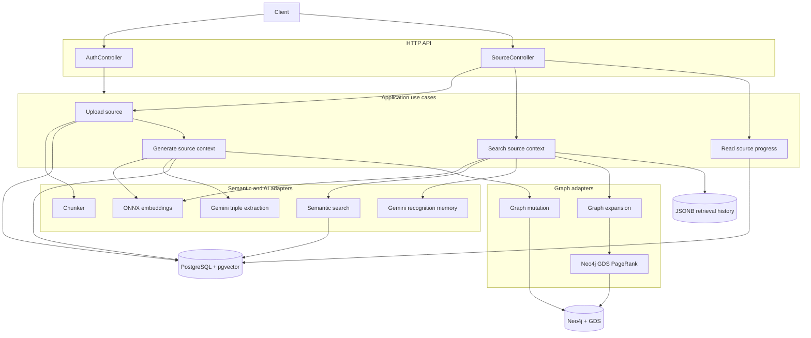
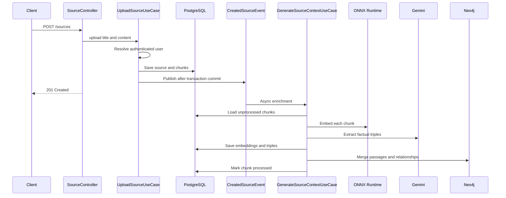
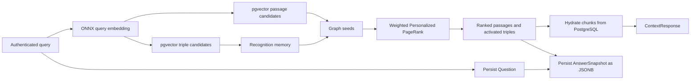
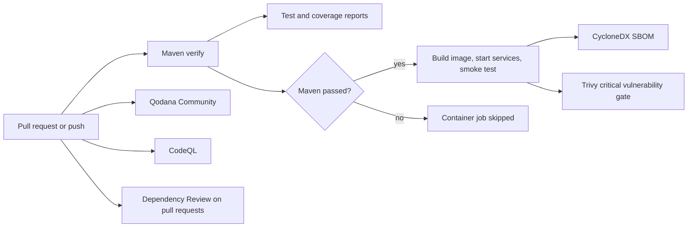

# Kairos

[](https://github.com/Luca5Eckert/Kairos/actions/workflows/ci.yml)
[](https://github.com/Luca5Eckert/Kairos/actions/workflows/qodana_code_quality.yml)
[](https://github.com/Luca5Eckert/Kairos/actions/workflows/security.yml)

<p>
  
  
  
  
  
  
  
  
</p>

**Standard RAG retrieves similar passages. Kairos is designed to retrieve connected knowledge.**

Kairos is a JVM-native personal knowledge graph engine for graph-augmented retrieval. It turns source material into durable chunks, extracts factual triples, creates local embeddings, and combines vector search with graph propagation to recover context that is related by meaning and structure.

The project is intentionally built as a retrieval backend rather than a chat interface. Its boundaries are explicit: PostgreSQL stores durable text, vectors, and retrieval history; Neo4j stores the graph projection; Gemini is used for extraction and recognition-memory decisions; the embedding model runs locally on the JVM.

> **Maturity:** experimental retrieval backend. Kairos has automated quality and security checks, but it has not undergone an independent security audit and does not claim production readiness. No software license or contribution policy has been published yet.

## Contents

- [What Kairos does](#what-kairos-does)
- [Current capabilities](#current-capabilities)
- [Why graph-augmented retrieval](#why-graph-augmented-retrieval)
- [Architecture](#architecture)
- [Data model](#data-model)
- [Ingestion flow](#ingestion-flow)
- [Retrieval and history flow](#retrieval-and-history-flow)
- [API](#api)
- [Quick start](#quick-start)
- [Security, privacy, and operations](docs/operations.md)
- [Testing and CI/CD](#testing-and-cicd)
- [Troubleshooting](#troubleshooting)
- [Limitations and roadmap](#limitations-and-roadmap)
- [Technical references](#technical-references)

## What Kairos does

Personal knowledge tools often rely on manual structure: folders, tags, links, and aliases. Kairos takes a different approach:

> Feed the system sources. Let the graph build itself.

The current retrieval path is inspired by HippoRAG 2:

1. A source is stored and split into overlapping chunks.
2. Chunks are embedded locally with `all-MiniLM-L6-v2` through ONNX Runtime.
3. Gemini extracts subject-predicate-object triples from each chunk.
4. Passages, concepts, and relationships are projected into a user-scoped Neo4j graph.
5. A query retrieves dense passage and triple candidates from pgvector.
6. Recognition memory selects concept seeds from the triple candidates.
7. Neo4j Graph Data Science runs weighted Personalized PageRank over the user's graph.
8. Final chunks are hydrated from PostgreSQL and returned together with the activated triples that explain the result.

## Current capabilities

| Area | Implemented capability |
| --- | --- |
| Application design | Hexagonal architecture with domain ports, application use cases, and infrastructure adapters |
| Authentication | Registration, email confirmation, login, JWT sessions, roles, and authenticated request context |
| User isolation | Source, vector, graph, progress, and retrieval queries are scoped to the authenticated user |
| Ingestion | Transactional source upload, overlapping chunking, durable persistence, and asynchronous enrichment after commit |
| Resume behavior | Failed chunks are visible in source progress and can be retried explicitly without reprocessing completed chunks |
| Embeddings | Local ONNX Runtime inference with `all-MiniLM-L6-v2` and `vector(384)` storage |
| Knowledge extraction | Gemini structured output for factual triple extraction and recognition-memory seed selection |
| Semantic search | PostgreSQL and pgvector HNSW indexes for passage and triple candidate retrieval |
| Graph retrieval | Neo4j 5.26 with Graph Data Science and weighted Personalized PageRank |
| Retrieval history | Immutable, versioned `AnswerSnapshot` documents stored as PostgreSQL `JSONB` |
| Progress | `GET /sources/progress` reports aggregate status and chunk counts by processing state for the current user |
| Delivery | Docker Compose for local infrastructure and GitHub Actions for build, quality, security, and container validation |

## Why graph-augmented retrieval

Vector search is strong at finding passages close to a query embedding. It is weaker when the answer depends on relationships spread across passages or on concepts that do not share the same wording.

| Vector-only RAG | Kairos |
| --- | --- |
| Retrieves chunks by embedding proximity | Retrieves passages, triples, and graph-expanded context |
| Treats chunks mostly independently | Connects chunks through concepts and extracted relationships |
| Relies on the LLM to infer most relationships at answer time | Surfaces relationship evidence before generation |
| Often depends on an external embedding service | Runs embeddings locally in the JVM |
| Rebuilds context from current data | Persists self-contained retrieval snapshots for history |

## Architecture

Kairos separates business decisions from framework and storage details. The domain owns retrieval concepts and ports; application use cases orchestrate workflows; infrastructure adapters integrate PostgreSQL, Neo4j, ONNX Runtime, Spring AI, mail, and security.


```mermaid
flowchart TB
    client[Client]

    subgraph api[HTTP API]
        auth[AuthController]
        sources[SourceController]
    end

    subgraph application[Application use cases]
        upload[Upload source]
        enrich[Generate source context]
        search[Search source context]
        progress[Read source progress]
    end

    subgraph semantic[Semantic and AI adapters]
        chunker[Chunker]
        embedder[ONNX embeddings]
        extractor[Gemini triple extraction]
        memory[Gemini recognition memory]
        vectors[Semantic search]
    end

    subgraph graph[Graph adapters]
        store[Graph mutation]
        graphSearch[Graph expansion]
        ppr[Neo4j GDS PageRank]
    end

    postgres[(PostgreSQL + pgvector)]
    neo4j[(Neo4j + GDS)]
    history[(JSONB retrieval history)]

    client --> auth
    client --> sources
    auth --> application
    sources --> upload
    sources --> search
    sources --> progress
    upload --> chunker
    upload --> postgres
    upload --> enrich
    enrich --> embedder
    enrich --> extractor
    enrich --> postgres
    enrich --> store
    store --> neo4j
    search --> embedder
    search --> vectors
    search --> memory
    search --> graphSearch
    search --> history
    vectors --> postgres
    progress --> postgres
    graphSearch --> ppr
    ppr --> neo4j
```

The stores have deliberately different responsibilities:

- **PostgreSQL** is the source of truth for users, sources, chunks, vectors, triples, progress, questions, and answers.
- **pgvector** is the PostgreSQL extension used for HNSW-backed dense passage and triple recall; it does not own the source data.
- **Neo4j with Graph Data Science** contains a user-scoped, derived projection of passages, concepts, and relationships, then runs weighted Personalized PageRank for graph propagation.
- **Gemini** is limited to structured triple extraction and constrained recognition-memory seed selection; it is not the primary ranking engine.
- **Answer snapshots** are self-contained historical records. Reading one does not require loading the current chunks, triples, or Neo4j graph.

## Data model

The persistent model separates durable knowledge from its graph projection:

| Record | Purpose | Storage |
| --- | --- | --- |
| Source | User-owned submitted document | PostgreSQL |
| Chunk | Overlapping, processable source segment with embedding and processing state | PostgreSQL + pgvector |
| Knowledge triple | Subject-predicate-object fact extracted from a chunk | PostgreSQL; projected to Neo4j |
| Passage and concept nodes | Derived graph representation connecting chunks through concepts | Neo4j |
| Question and `AnswerSnapshot` | Immutable, versioned record of a retrieval execution and its returned context | PostgreSQL JSONB |

The model makes a Neo4j rebuild possible from durable PostgreSQL data, while a historical answer remains readable without depending on the current graph or chunks. A supported rebuild command, endpoint, or job is **not** implemented yet.

## Ingestion flow

`POST /sources` commits the source and its chunks before asynchronous enrichment begins. This keeps the upload path durable and makes failed enrichment resumable.


```mermaid
sequenceDiagram
    participant C as Client
    participant API as SourceController
    participant U as UploadSourceUseCase
    participant PG as PostgreSQL
    participant E as CreatedSourceEvent
    participant G as GenerateSourceContextUseCase
    participant ORT as ONNX Runtime
    participant LLM as Gemini
    participant N as Neo4j

    C->>API: POST /sources
    API->>U: upload title and content
    U->>U: Resolve authenticated user
    U->>PG: Save source and chunks
    U->>E: Publish after transaction commit
    API-->>C: 201 Created
    E->>G: Async enrichment
    G->>PG: Load unprocessed chunks
    G->>ORT: Embed each chunk
    G->>LLM: Extract factual triples
    G->>PG: Save embeddings and triples
    G->>N: Merge passages and relationships
    G->>PG: Mark chunk processed
```

If enrichment fails, the affected chunk is marked as `FAILED`, chunks already completed remain complete, and processing continues with the remaining claimed chunks. The authenticated owner can retry only failed chunks through `POST /sources/{sourceId}/retry`; automatic retries remain intentionally out of scope.

## Retrieval and history flow

`POST /sources/search` is user-scoped from the request context. Every execution persists the question and an immutable answer snapshot, while the public response remains focused on ranked chunks and activated triples.


```mermaid
flowchart LR
    query[Authenticated query] --> embedding[ONNX query embedding]
    embedding --> passageCandidates[pgvector passage candidates]
    embedding --> tripleCandidates[pgvector triple candidates]
    tripleCandidates --> recognition[Recognition memory]
    passageCandidates --> seeds[Graph seeds]
    recognition --> seeds
    seeds --> ppr[Weighted Personalized PageRank]
    ppr --> ranked[Ranked passages and activated triples]
    ranked --> hydrate[Hydrate chunks from PostgreSQL]
    hydrate --> response[ContextResponse]
    query --> question[Persist Question]
    ranked --> snapshot[Persist AnswerSnapshot as JSONB]
    question --> snapshot
```

### Retrieval defaults

These defaults are bound from `kairos.retrieval` and can be overridden through the corresponding `KAIROS_*` environment variables.

| Setting | Default | Role |
| --- | ---: | --- |
| `semantic-anchor-limit` | 10 | Dense passage candidates used as direct graph anchors |
| `graph-passage-limit` | 20 | Maximum passages returned after graph ranking |
| `triple-candidate-limit` | 30 | Dense triple candidates presented to recognition memory |
| `recognition-seed-limit` | 10 | Maximum concept seeds selected from triple candidates |
| `seed-min-score` | 0.45 | Minimum score required for a graph seed |
| `seed-relative-threshold` | 0.85 | Relative score threshold applied to seed selection |

All Spring configuration options are documented in [docs/configuration.md](docs/configuration.md). The history model is implemented internally, but there is not yet a public endpoint for listing or reading historical questions and answers.

## Data locality and external processing

Embeddings are generated locally in the JVM. This does **not** mean all document data stays local:

- during ingestion, the complete content of each chunk is sent to Gemini for triple extraction;
- during search, Gemini receives the user query and the selected candidate triples (subject, predicate, object, and score) for recognition-memory seed selection;
- Kairos currently configures Gemini as its LLM provider. The extraction and recognition interfaces are domain ports, but no local LLM provider is supplied or documented.

Do not submit sensitive content unless its processing by the configured Gemini provider is acceptable for your environment. See [security, privacy, and operational limitations](docs/operations.md) before deployment.

## API

All `/sources/**` endpoints require a valid JWT bearer token. Authentication endpoints are public.

| Method | Path | Authentication | Description |
| --- | --- | --- | --- |
| `POST` | `/auth/register` | Public | Creates a pending user and sends an email confirmation code |
| `POST` | `/auth/confirm-email` | Public | Confirms a user and returns a JWT |
| `POST` | `/auth/login` | Public | Authenticates by username or email and returns a JWT |
| `POST` | `/sources` | JWT | Stores a source and starts asynchronous enrichment |
| `POST` | `/sources/search` | JWT | Searches the authenticated user's graph-augmented knowledge base |
| `GET` | `/sources/progress` | JWT | Lists source chunk progress for the authenticated user |
| `POST` | `/sources/{sourceId}/retry` | JWT | Asynchronously retries only failed chunks owned by the authenticated user |

OpenAPI/Swagger is not configured in the current build. The complete request collection, validation cases, authentication flow, and local environment are available in [docs/postman/Kairos.postman_collection.json](docs/postman/Kairos.postman_collection.json) and [docs/postman/Kairos.local.postman_environment.json](docs/postman/Kairos.local.postman_environment.json).

### Try the API locally

After starting Docker Compose, the host-facing API is available at `http://127.0.0.1:8081` when using the supplied `.env.example`. The application listens on port `8080` inside its container.

The Docker profile creates a local admin when `KAIROS_ADMIN_BOOTSTRAP_ENABLED=true`. Change the default credentials before using the stack outside local development.

```bash
curl -X POST http://127.0.0.1:8081/auth/login \
  -H "Content-Type: application/json" \
  -d '{"identifier":"admin","password":"Admin123!"}'
```

Export the returned token as `TOKEN`, then upload a source:

```bash
curl -X POST http://127.0.0.1:8081/sources \
  -H "Authorization: Bearer $TOKEN" \
  -H "Content-Type: application/json" \
  -d '{"title":"RAG and knowledge graphs","content":"Knowledge graphs connect entities and relationships across passages."}'
```

Check asynchronous progress:

```bash
curl http://127.0.0.1:8081/sources/progress \
  -H "Authorization: Bearer $TOKEN"
```

Search the authenticated knowledge base after enrichment has processed the chunks:

```bash
curl -X POST http://127.0.0.1:8081/sources/search \
  -H "Authorization: Bearer $TOKEN" \
  -H "Content-Type: application/json" \
  -d '{"termQuery":"How do knowledge graphs improve retrieval?"}'
```

The endpoint returns graph evidence separately from ranked chunks. UUIDs and scores below are illustrative; field names match the public response contract.

```json
{
  "knowledgeGraph": [
    {
      "subject": "Knowledge graphs",
      "predicate": "connect",
      "object": "entities across passages",
      "chunkId": "c4f2397a-c1a0-4eaa-92b7-117ef8cba3b9"
    }
  ],
  "chunkContexts": [
    {
      "chunkId": "c4f2397a-c1a0-4eaa-92b7-117ef8cba3b9",
      "content": "Knowledge graphs connect entities and relationships across passages.",
      "rank": 1,
      "score": 0.7812,
      "source": "GRAPH"
    }
  ]
}
```

## Quick start

### Prerequisites

- Docker Desktop with Docker Compose;
- a Gemini API key for extraction and recognition memory;
- SMTP credentials for confirmation email delivery;
- Java 21 and Bash if running Maven locally.

### Run with Docker Compose

1. Create the environment file (choose the command for your shell):

   ```bash
   cp .env.example .env
   ```

   ```powershell
   Copy-Item .env.example .env
   ```

2. Fill `GEMINI_API_KEY`, mail credentials, and database passwords. Replace `AUTH_SESSION_SECRET` with a long random value and change `KAIROS_ADMIN_PASSWORD`.
3. Start the stack:

   ```bash
   docker compose up --build --detach
   ```

4. Wait for the health checks and verify the application:

   ```bash
   curl http://127.0.0.1:8081/actuator/health
   ```

The host port comes from `APP_PORT` in `.env`; the provided example uses `8081`. The application always listens on `8080` inside the container. PostgreSQL, Neo4j HTTP, and Neo4j Bolt are bound to localhost by default.

For a complete configuration reference and retrieval tuning options, see [docs/configuration.md](docs/configuration.md).

### Run Maven locally

The Maven wrapper can compile and test the project without running the application container:

```bash
./mvnw --batch-mode --no-transfer-progress clean verify
```

On Windows:

```powershell
.\mvnw.cmd --batch-mode --no-transfer-progress clean verify
```

Integration tests use Testcontainers and require an accessible Docker daemon. When Docker is unavailable, those tests are skipped by design; the GitHub Actions runner executes them with Docker enabled.

## Testing and CI/CD

The quality gates validate implementation behavior and regressions. They do not, by themselves, prove retrieval gains in Recall@K, MRR, NDCG, or answer quality; those claims require a labeled evaluation set.

Latest verified local run (`2026-07-29`, `./mvnw clean verify`):

| Signal | Result |
| --- | --- |
| Tests | 262 executed; 0 failures, 0 errors, 9 skipped |
| JaCoCo line coverage | 87.15% |
| JaCoCo branch coverage | 73.00% |

The repository uses three GitHub Actions workflows. CI, Qodana, and Security start independently for pull requests and pushes to `main` or `develop`.


```mermaid
flowchart LR
    event[Pull request or push] --> ci[Maven verify]
    event --> quality[Qodana Community]
    event --> security[CodeQL]
    event --> dependency[Dependency Review on pull requests]
    ci --> reports[Test and coverage reports]
    ci --> gate{Maven passed?}
    gate -->|yes| container[Build image, start services, smoke test]
    gate -->|no| skipped[Container job skipped]
    container --> sbom[CycloneDX SBOM]
    container --> trivy[Trivy critical vulnerability gate]
```

### CI workflow

The `CI` workflow runs the following sequence:

1. Set up Java 21 and Maven caching.
2. Download the pinned ONNX model with `infra/scripts/prepare-model.sh`.
3. Verify the model SHA-256 checksum.
4. Run `./mvnw clean verify`, including unit tests, Testcontainers integration tests, packaging, and JaCoCo enforcement.
5. Upload test, coverage, and application artifacts.
6. Only after Maven succeeds, validate Compose and build the application image.
7. Start PostgreSQL and Neo4j, run Kairos, and wait for `/actuator/health`.
8. Generate a CycloneDX SBOM and scan the image with Trivy.

The container job depends on `Maven verify`. A Maven failure therefore makes the container job `skipped`; it is not a second independent failure.

### Quality and security gates

- **JaCoCo**: the build fails below 80% line coverage or 70% branch coverage.
- **Qodana Community**: publishes annotations and workflow artifacts; it runs without `QODANA_TOKEN` and is not connected to Qodana Cloud.
- **CodeQL**: performs Java/Kotlin security analysis and publishes findings in the repository Security tab.
- **Dependency Review**: runs on pull requests and blocks dependency changes with high severity or higher.
- **Trivy**: creates the container SBOM and blocks fixable critical vulnerabilities in OS and library packages.
- **Dependabot**: checks Maven, Docker, and GitHub Actions weekly.

CI retains test and coverage reports plus the JAR for 14 days. The container SBOM is retained for 30 days.

### Branch rules

For the protected `main` branch, require the successful checks exposed by the workflows, including Maven, container validation, Qodana, CodeQL, and Dependency Review. The exact check names should be selected from a completed run in the repository ruleset UI. Enable the `merge_group` trigger before using merge queue with required checks.

## Troubleshooting

| Symptom | Likely cause | What to check |
| --- | --- | --- |
| Compose reports a missing variable | A required database, mail, or credential variable is empty | Fill `.env` using [docs/configuration.md](docs/configuration.md) |
| The health endpoint is unreachable | Services are still starting or the host port differs from `APP_PORT` | Run `docker compose ps`, inspect logs, and use the configured host port |
| `/sources` or `/sources/search` returns `401` | The route requires a valid JWT | Log in or confirm the user and send `Authorization: Bearer $TOKEN` |
| Upload returns `201` but search is empty | Enrichment runs asynchronously | Poll `/sources/progress` and wait for processed chunks |
| A source reports `FAILED` | A chunk failed during enrichment | Inspect application logs, then call `POST /sources/{sourceId}/retry` to retry only failed chunks. |
| Graph results are empty | Neo4j GDS is unavailable or graph enrichment has not completed | Check Neo4j logs and the application warning about unavailable GDS procedures |
| Existing local data fails schema validation | A volume was created with an older schema | For disposable development data, run `docker compose down --volumes` and recreate the stack |
| Gemini extraction fails | The API key or model configuration is missing or invalid | Check `GEMINI_API_KEY`, `KAIROS_LLM_MODEL`, and Spring AI settings |
| Logs mention `token_type_ids` are not declared | The current ONNX model does not require that input | This is expected and covered by embedding tests |

## Limitations and roadmap

The current V1 is experimental, not a complete end-user knowledge application or a security-audited production service. The main remaining gaps are:

- an automatic retry scheduler and Neo4j rebuild procedure;
- a public API for reading persisted questions and answer snapshots;
- OpenAPI/Swagger publication;
- a dense-search fallback when Neo4j GDS is unavailable;
- request-size limits, rate limiting, and upload-abuse controls;
- a stable Spring AI release (the current `2.0.0-M6` dependency is a milestone release);
- a published software license, contribution guide, and vulnerability-disclosure policy;
- broader user-management features beyond authentication and source ownership.

Search the repository's [open GitHub Issues](https://github.com/Luca5Eckert/Kairos/issues) for the current roadmap. Completed retrieval work, including HippoRAG 2 search and JSONB retrieval history, is documented as current capability rather than future work.

## Technical references

- [Configuration reference](docs/configuration.md)
- [Security, privacy, and operations](docs/operations.md)
- [ADR index](docs/adr/)
- [Postman collection](docs/postman/Kairos.postman_collection.json)
- [HippoRAG 2: From RAG to Memory](https://arxiv.org/abs/2502.14802)
- [pgvector documentation](https://access.crunchydata.com/documentation/pgvector/latest/)
- [Neo4j Graph Data Science PageRank](https://neo4j.com/docs/graph-data-science/current/algorithms/page-rank/)
- [Spring AI structured output](https://docs.spring.io/spring-ai/reference/api/structured-output-converter.html)
- [ONNX Runtime for Java](https://onnxruntime.ai/docs/get-started/with-java.html)
- [all-MiniLM-L6-v2 model card](https://huggingface.co/sentence-transformers/all-MiniLM-L6-v2)

---

Built by [Lucas Eckert](https://luca5eckert.github.io)
