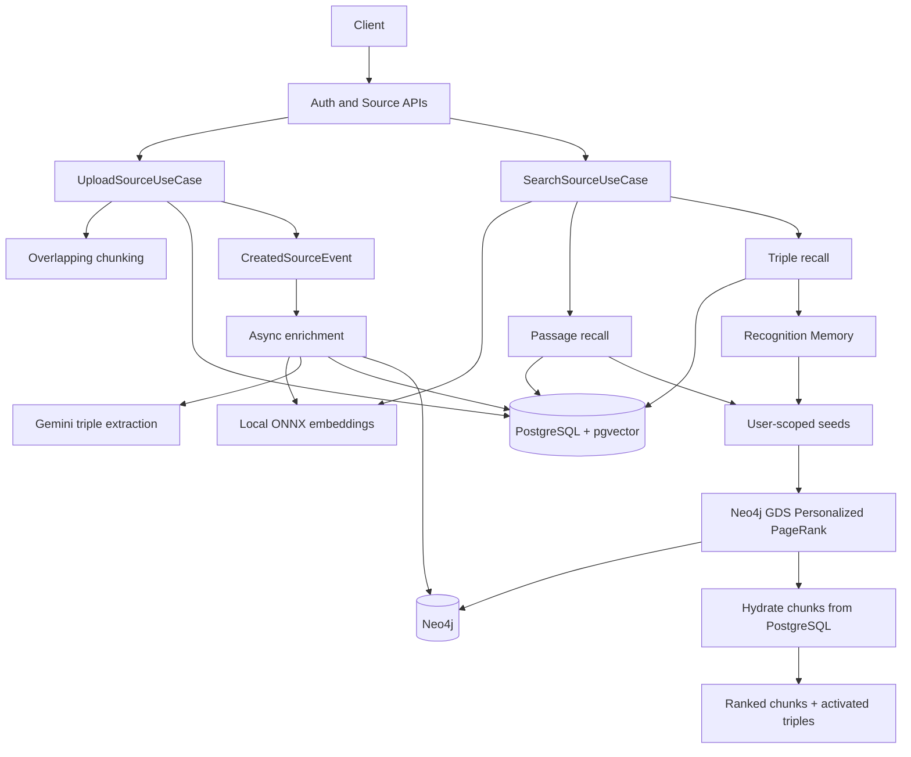
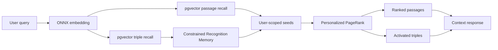

# Kairos

> Standard RAG retrieves similar passages. Kairos retrieves passages together with the relationships that connect them.

[](https://openjdk.org/)
[](https://spring.io/projects/spring-boot)
[](https://www.postgresql.org/)
[](https://neo4j.com/)
[](#verification)
[](#verification)

Kairos is a JVM-native graph-augmented retrieval backend for personal knowledge systems. It ingests source material, creates durable overlapping chunks, extracts subject-predicate-object triples, embeds passages and triples, and combines PostgreSQL/pgvector recall with user-scoped Neo4j Graph Data Science propagation.

The project is intentionally a retrieval engine rather than a chatbot or note editor. Its purpose is to expose useful context and relationship evidence before answer generation.

## Evidence at a glance

| Signal | Current evidence |
|---|---:|
| Latest local test execution | 244 tests |
| Failures / errors | 0 / 0 |
| Skipped tests | 7 |
| JaCoCo line coverage | 86.77% |
| JaCoCo branch coverage | 74.54% |
| Embeddings | local ONNX, 384 dimensions |
| Semantic store | PostgreSQL + pgvector |
| Graph propagation | Neo4j GDS Personalized PageRank |

Coverage measures implementation quality. It does not prove retrieval relevance.

## Problem, failed approach, decision

### Problem

Dense vector search is effective for semantic similarity, but it can miss context that depends on relationships distributed across passages and extracted facts.

### First approach

The first graph-seed implementation retrieved concepts independently by dense similarity. It was mechanically valid, but isolated concept matches lost the subject-predicate-object context in which those concepts appeared.

There was no labeled retrieval benchmark, so the quality gap could not be quantified cleanly.

### Decision

Keep graph expansion stable and change only how seeds are selected:

1. retrieve passage candidates from pgvector;
2. retrieve triple candidates from pgvector;
3. allow Recognition Memory to select only subjects or objects already present in those triples;
4. combine passage and concept seeds;
5. run user-scoped Personalized PageRank;
6. return ranked chunks and activated triples as evidence.

### Result

The current pipeline exposes both semantically relevant passages and the relationships activated during graph propagation. The architecture is covered by 244 executed tests, with 86.77% line coverage and 74.54% branch coverage.

A relevance improvement is not claimed yet. The next research step is a labeled evaluation set comparing vector-only retrieval, isolated concept seeds, and triple-based Recognition Memory.

## Architecture


```mermaid
flowchart TB
    Client[Client] --> API[Auth and Source APIs]

    API --> Upload[UploadSourceUseCase]
    Upload --> Chunker[Overlapping chunking]
    Upload --> PG[(PostgreSQL + pgvector)]
    Upload --> Event[CreatedSourceEvent]

    Event --> Enrich[Async enrichment]
    Enrich --> ONNX[Local ONNX embeddings]
    Enrich --> Gemini[Gemini triple extraction]
    Enrich --> PG
    Enrich --> Neo[(Neo4j)]

    API --> Search[SearchSourceUseCase]
    Search --> ONNX
    Search --> PassageRecall[Passage recall]
    Search --> TripleRecall[Triple recall]
    PassageRecall --> PG
    TripleRecall --> PG
    TripleRecall --> Recognition[Recognition Memory]
    PassageRecall --> Seeds[User-scoped seeds]
    Recognition --> Seeds
    Seeds --> PPR[Neo4j GDS Personalized PageRank]
    PPR --> Neo
    PPR --> Hydrate[Hydrate chunks from PostgreSQL]
    Hydrate --> Response[Ranked chunks + activated triples]
```

## Store responsibilities

| Component | Responsibility |
|---|---|
| PostgreSQL | durable source, chunk, triple, user, and authentication data |
| pgvector | dense passage and triple retrieval |
| Neo4j | structural graph projection of passages, concepts, and relationships |
| Neo4j GDS | graph propagation from selected seeds |
| ONNX Runtime | local JVM embedding inference |
| Gemini via Spring AI | triple extraction and constrained recognition decisions |

Gemini is behind domain ports and is not used as the primary ranking engine.

## Ingestion flow

`POST /sources` starts a durable-then-asynchronous pipeline:

1. Accept source title and content.
2. Resolve the authenticated author from request context.
3. Detect duplicate content for the same author.
4. Persist the source and overlapping chunks in PostgreSQL.
5. Publish `CreatedSourceEvent`.
6. Embed chunks locally with ONNX Runtime.
7. Extract factual triples through Spring AI/Gemini.
8. Embed triple keys for triple-level recall.
9. Persist embeddings and triples in PostgreSQL.
10. Merge user-scoped passages, concepts, and relationships into Neo4j.
11. Mark processed chunks as complete.

Durable chunks are stored before external enrichment. This separates source acceptance from later model and graph work.

## Retrieval flow

`POST /sources/search` accepts a query and returns ranked chunks plus relationship evidence.

1. Resolve the authenticated user.
2. Generate the query embedding with the same local ONNX model used for ingestion.
3. Retrieve user-scoped passage candidates from pgvector.
4. Retrieve user-scoped triple candidates from pgvector.
5. Ask Recognition Memory to select relevant subjects or objects from the retrieved triples.
6. Apply absolute and relative seed thresholds.
7. Project only the authenticated user's Neo4j subgraph.
8. Run Personalized PageRank from passage and concept seeds.
9. Rank passage nodes by graph score.
10. Rehydrate chunk text from PostgreSQL under the same ownership constraint.
11. Return chunks and activated triples.


```mermaid
flowchart LR
    Query[User query] --> Embed[ONNX embedding]
    Embed --> Passages[pgvector passage recall]
    Embed --> Triples[pgvector triple recall]
    Triples --> Recognition[Constrained Recognition Memory]
    Passages --> Seeds[User-scoped seeds]
    Recognition --> Seeds
    Seeds --> PPR[Personalized PageRank]
    PPR --> Chunks[Ranked passages]
    PPR --> Evidence[Activated triples]
    Chunks --> Response[Context response]
    Evidence --> Response
```

## Security and ownership

User isolation is treated as a first-class retrieval constraint:

- source ownership is resolved from authenticated request context, not client-submitted IDs;
- passage and triple recall filter by source author;
- Neo4j projections include only the authenticated user's graph;
- final chunk hydration applies the ownership filter again;
- JWT-protected routes cover source ingestion and retrieval.

This boundary is applied across both stores rather than added only at the API layer.

## Architecture style

Kairos uses ports and adapters to isolate volatile infrastructure:

| Layer | Responsibility |
|---|---|
| `domain` | models and ports without framework dependencies |
| `application` | ingestion, retrieval, authentication, and orchestration use cases |
| `infrastructure` | PostgreSQL, Neo4j, ONNX, Gemini, email, and security adapters |
| `presentation` | controllers and HTTP DTO mapping |

The design allows embedding, graph, semantic-search, and LLM implementations to change without moving their concerns into domain logic.

## Verification

Latest recorded local run:

| Date | Command | Result |
|---|---|---|
| 2026-07-20 | `.\mvnw.cmd test` | 244 tests, 0 failures, 0 errors, 7 skipped |

Additional evidence:

| Check | Result |
|---|---|
| JaCoCo line coverage | 86.77% |
| JaCoCo branch coverage | 74.54% |
| Surefire reports | 34 XML reports |
| `git diff --check` | passing |

The suite covers:

- registration, email confirmation, login, JWT, and request context;
- source upload, duplicate handling, event publication, and asynchronous enrichment;
- chunking, ONNX inference, tokenization, pooling, normalization, and error paths;
- passage recall, triple recall, recognition selection, seed thresholds, and empty results;
- user-scoped Neo4j mutation, GDS projection, Personalized PageRank, and cleanup;
- PostgreSQL mapping, score handling, chunk hydration, and ordering.

Run tests:

```bash
./mvnw test
```

Windows:

```powershell
.\mvnw.cmd test
```

## Running locally

### Requirements

- Docker and Docker Compose
- Java 21 for direct Maven execution
- Gemini API key
- SMTP configuration for account confirmation

Create the environment file:

```bash
cp .env.example .env
```

Start the stack:

```bash
docker compose up --build
```

Check health:

```bash
curl http://localhost:8080/actuator/health
```

The local stack contains PostgreSQL, Neo4j, and the Kairos application.

## Example flow

1. Authenticate and obtain a JWT.
2. Submit a source to `POST /sources`.
3. Wait for asynchronous enrichment.
4. Query `POST /sources/search`.
5. Inspect ranked chunks and activated triples in the response.

Detailed configuration is documented in [`docs/configuration.md`](docs/configuration.md).

## Design decisions

| Decision | Trade-off |
|---|---|
| PostgreSQL as textual source of truth | Keeps durable text and vectors together, while requiring Neo4j projection maintenance |
| Neo4j as derived structural graph | Enables graph algorithms without making it the durable source for source text |
| Local ONNX embeddings | Removes a Python sidecar and external embedding call, but adds model memory to the JVM process |
| LLM only for extraction and recognition | Limits model authority and keeps ranking deterministic around stored evidence, while retaining model cost and variability |
| Durable chunks before enrichment | Protects accepted source content from external model failures, while requiring retry and reprocessing workflows |
| User-scoped graph projection | Enforces isolation during propagation, at the cost of per-query projection work |
| Activated triples in the response | Improves inspectability, while not constituting a formal explanation guarantee |

## Known limitations

- No labeled retrieval benchmark currently proves higher Recall@K, MRR, NDCG, or answer quality.
- Failed chunk reprocessing is not fully implemented.
- If Neo4j GDS is unavailable, graph expansion returns no graph result rather than a dense fallback.
- Enrichment is asynchronous; immediate queries may see incomplete context.
- Persisted retrieval traces and user-facing graph views remain roadmap work.
- OpenAPI/Swagger UI is not configured in the current build.

## Evaluation roadmap

The next evidence milestone is a reproducible retrieval benchmark:

1. build a labeled set of queries and relevant passages;
2. compare vector-only, isolated-concept, and triple-recognition variants;
3. report Recall@K, MRR or NDCG;
4. record p50/p95 latency;
5. measure model calls and cost;
6. publish failure cases, not only aggregate scores.

## Relevant design documents

- [PR #59 - triple-based recognition-memory seeds](https://github.com/Luca5Eckert/Kairos/pull/59)
- [`ADR-003 - Retrieval Framework`](docs/adr/ADR-003-retrieval-framework.md)
- Additional planning and ADR material is maintained with the project documentation and engineering notes.

## Author

Built by [Lucas Eckert](https://lucas-eckert.vercel.app).
