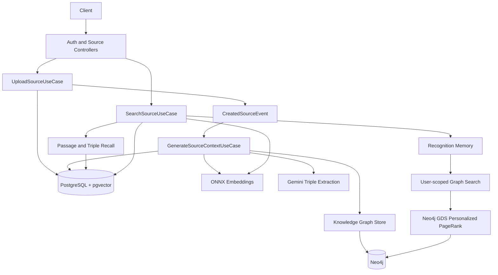
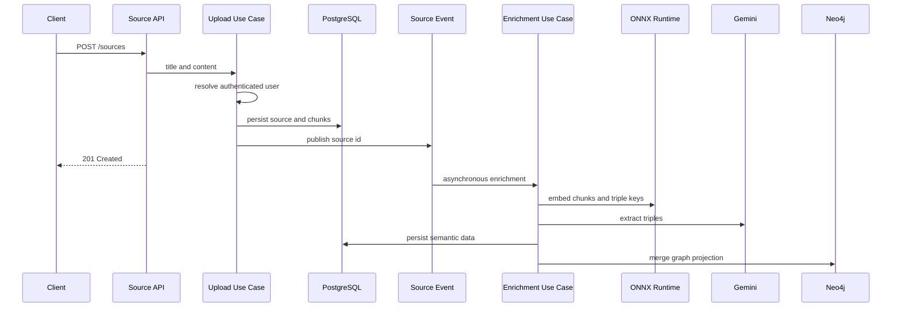
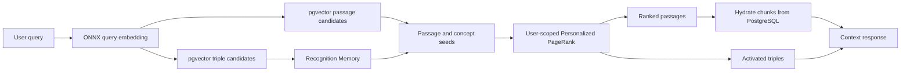

# Kairos

> Standard vector retrieval finds similar passages. Kairos also follows the relationships that connect them.

[](https://openjdk.org/)
[](https://spring.io/projects/spring-boot)
[](https://spring.io/projects/spring-ai)
[](https://www.postgresql.org/)
[](https://neo4j.com/)
[](#verification)
[](#verification)
[](#verification)

Kairos is a JVM-native graph-augmented retrieval backend for personal knowledge systems. It ingests sources, creates durable overlapping chunks, extracts factual subject-predicate-object triples, embeds passages and triples, and combines dense retrieval with graph propagation.

The system uses each storage engine for a distinct responsibility:

- **PostgreSQL** is the durable application and text source of truth.
- **pgvector** retrieves semantically similar passages and triples.
- **Neo4j** stores a user-scoped structural projection.
- **Neo4j Graph Data Science** propagates relevance through Personalized PageRank.
- **Gemini, behind Spring AI ports**, is limited to triple extraction and constrained recognition-memory seed selection.
- **ONNX Runtime** generates embeddings locally inside the JVM.

## Problem, decision, result

### Problem

The first graph-seed implementation retrieved isolated concepts directly by dense similarity. It worked as an implementation, but a concept name alone lost the relation context carried by a complete triple.

For example, retrieving only `Personalized PageRank` is less informative than retrieving a candidate fact such as:

```text
Personalized PageRank -> PROPAGATES_IMPORTANCE_THROUGH -> connected concepts
```

### Decision

Keep graph expansion stable and change how seeds are selected:

1. retrieve dense passage candidates;
2. retrieve dense triple candidates;
3. let Recognition Memory select only subjects or objects that already exist in those candidate triples;
4. combine passage and concept seeds;
5. apply absolute and relative score thresholds;
6. run Personalized PageRank on the authenticated user's graph projection;
7. return ranked chunks plus activated triples as evidence.

This evolution is implemented in [PR #59](https://github.com/Luca5Eckert/Kairos/pull/59).

### Result

- Retrieval is passage-first and relation-aware.
- Responses contain ranked chunks and the triples activated by graph propagation.
- User ownership is enforced during dense candidate retrieval, graph projection, PageRank expansion, and final chunk hydration.
- Latest local verification executed **244 tests**, with **0 failures**, **0 errors**, and **7 skipped**.
- JaCoCo reports **86.77% line coverage** and **74.54% branch coverage**.

These metrics verify implementation behavior. They do **not** prove that retrieval relevance improved. Kairos still needs a labeled evaluation set before claiming gains in Recall@K, MRR, NDCG, or answer quality.

## Current state

Kairos is an operational V1 backend. The graph-augmented ingestion and retrieval paths are implemented; product-facing graph views, failed-chunk reprocessing, persisted retrieval traces, and formal retrieval evaluation remain future work.

| Area | Current implementation |
|---|---|
| Authentication | Registration, email confirmation, login, JWT issuance, roles, request context, and protected source routes |
| Ingestion | Durable source and chunk persistence followed by asynchronous enrichment |
| Embeddings | Local ONNX Runtime inference with `all-MiniLM-L6-v2`, producing `vector(384)` values |
| Triple extraction | Gemini through Spring AI `ChatClient` and structured output |
| Semantic storage | PostgreSQL 16 with pgvector/HNSW for passage and triple retrieval |
| Graph storage | User-scoped `Passage`, `PhraseNode`, `CONTAINS`, and `TRIPLE` structures in Neo4j |
| Retrieval | Passage recall, triple recall, constrained Recognition Memory, seed filtering, and Personalized PageRank |
| Response | Ranked chunks plus activated knowledge triples |
| Local runtime | Docker Compose services for PostgreSQL, Neo4j, and Kairos |

## Architecture

Kairos follows a hexagonal architecture. Domain and application code depend on ports; PostgreSQL, Neo4j, ONNX Runtime, Spring AI, mail, and security remain infrastructure adapters.


```mermaid
flowchart TB
    client[Client] --> api[Auth and Source Controllers]

    api --> upload[UploadSourceUseCase]
    api --> search[SearchSourceUseCase]

    upload --> postgres[(PostgreSQL + pgvector)]
    upload --> event[CreatedSourceEvent]
    event --> enrich[GenerateSourceContextUseCase]

    enrich --> onnx[ONNX Embeddings]
    enrich --> gemini[Gemini Triple Extraction]
    enrich --> postgres
    enrich --> graphStore[Knowledge Graph Store]
    graphStore --> neo4j[(Neo4j)]

    search --> onnx
    search --> semantic[Passage and Triple Recall]
    semantic --> postgres
    search --> recognition[Recognition Memory]
    recognition --> graphSearch[User-scoped Graph Search]
    graphSearch --> gds[Neo4j GDS Personalized PageRank]
    gds --> neo4j
    search --> postgres
```

### Layer responsibilities

| Layer | Responsibility |
|---|---|
| `domain` | Models and ports without framework dependencies |
| `application` | Commands, queries, use cases, and orchestration |
| `infrastructure` | PostgreSQL, Neo4j, ONNX, Gemini, email, security, and event adapters |
| `presentation` | Controllers, request/response DTOs, and mappers |

## Ingestion flow

`POST /sources` starts the knowledge-building process.

1. Accept source `title` and `content`.
2. Resolve the authenticated author through `RequestContextProvider`; do not trust a client-submitted author id.
3. Return an existing source when the same authenticated author, title, and content were already ingested.
4. Persist the source and overlapping chunks in PostgreSQL.
5. Publish `CreatedSourceEvent`.
6. Enrich unprocessed chunks asynchronously.
7. Generate chunk embeddings with ONNX Runtime.
8. Extract factual triples with Gemini.
9. Generate triple-key embeddings.
10. Store embeddings and triples in PostgreSQL.
11. Merge user-scoped passages, concepts, and relationships into Neo4j.
12. Mark the chunks as processed.


```mermaid
sequenceDiagram
    participant C as Client
    participant API as Source API
    participant U as Upload Use Case
    participant PG as PostgreSQL
    participant E as Source Event
    participant G as Enrichment Use Case
    participant O as ONNX Runtime
    participant L as Gemini
    participant N as Neo4j

    C->>API: POST /sources
    API->>U: title and content
    U->>U: resolve authenticated user
    U->>PG: persist source and chunks
    U->>E: publish source id
    API-->>C: 201 Created
    E->>G: asynchronous enrichment
    G->>O: embed chunks and triple keys
    G->>L: extract triples
    G->>PG: persist semantic data
    G->>N: merge graph projection
```

## Retrieval flow

`POST /sources/search` accepts a `termQuery`.

1. Resolve the authenticated user.
2. Embed the query with the same local ONNX model used during ingestion.
3. Retrieve passage candidates from pgvector, filtered by source ownership.
4. Retrieve triple candidates from pgvector, filtered by source ownership.
5. Ask Recognition Memory to choose relevant candidate subjects or objects.
6. Combine passage and concept seeds.
7. Apply minimum and relative score thresholds.
8. Project only the authenticated user's Neo4j subgraph.
9. Run Personalized PageRank from the selected seeds.
10. Rank passage nodes by graph score.
11. Rehydrate final chunk text from PostgreSQL, filtered again by ownership.
12. Return chunks and activated triples.


```mermaid
flowchart LR
    query[User query] --> embed[ONNX query embedding]
    embed --> passages[pgvector passage candidates]
    embed --> triples[pgvector triple candidates]
    triples --> recognition[Recognition Memory]
    passages --> seeds[Passage and concept seeds]
    recognition --> seeds
    seeds --> ppr[User-scoped Personalized PageRank]
    ppr --> ranked[Ranked passages]
    ppr --> evidence[Activated triples]
    ranked --> hydrate[Hydrate chunks from PostgreSQL]
    hydrate --> response[Context response]
    evidence --> response
```

## Why two stores

PostgreSQL and Neo4j are not interchangeable copies of the same data.

**PostgreSQL responsibilities**

- durable sources and chunks;
- user and authentication data;
- passage embeddings;
- triple records and triple-key embeddings;
- dense candidate retrieval;
- final chunk hydration.

**Neo4j responsibilities**

- a structural projection of passages and concepts;
- `CONTAINS` passage-to-concept edges;
- `TRIPLE` concept-to-concept edges;
- graph propagation and activated-relation discovery.

This split adds synchronization work, but it keeps durable text and transactional application state in PostgreSQL while using Neo4j only for the graph operations it is meant to perform.

## LLM boundary

Gemini is not used as the embedding service or as an unrestricted graph-search agent.

It is isolated behind ports for two bounded decisions:

1. extract structured subject-predicate-object facts during enrichment;
2. select concept seeds from a finite set of already retrieved triple candidates.

This keeps the core retrieval orchestration testable and limits model-generated output to explicit infrastructure boundaries.

## API

OpenAPI/Swagger UI is not configured in the current build.

| Method | Path | Purpose |
|---|---|---|
| `POST` | `/auth/register` | Create a pending account |
| `POST` | `/auth/confirm-email` | Confirm the account and return a JWT |
| `POST` | `/auth/login` | Authenticate and return a JWT |
| `POST` | `/sources` | Ingest a source for the authenticated user |
| `POST` | `/sources/search` | Retrieve ranked context and activated triples |

## Running locally

### Prerequisites

- Docker and Docker Compose
- Java 21 for direct Maven execution
- Gemini API credentials
- SMTP settings required by the current Compose profile

### Environment

```bash
cp .env.example .env
```

Fill the required PostgreSQL, Neo4j, Gemini, authentication, and mail values.

### Start

```bash
docker compose up --build
```

The application binds to `127.0.0.1:8080` by default. PostgreSQL and Neo4j are also bound to localhost.

### Health

```bash
curl http://localhost:8080/actuator/health
```

## Example flow

### Login

```bash
curl -X POST http://localhost:8080/auth/login \
  -H "Content-Type: application/json" \
  -d '{"identifier":"admin","password":"Admin123!"}'
```

Use the returned JWT as `TOKEN`.

### Ingest

```bash
curl -X POST http://localhost:8080/sources \
  -H "Content-Type: application/json" \
  -H "Authorization: Bearer $TOKEN" \
  -d '{
    "title": "RAG and knowledge graphs",
    "content": "Knowledge graphs represent entities and relationships explicitly. Personalized PageRank can propagate importance from relevant passages through connected concepts."
  }'
```

Enrichment is asynchronous, so querying immediately can return incomplete context.

### Search

```bash
curl -X POST http://localhost:8080/sources/search \
  -H "Content-Type: application/json" \
  -H "Authorization: Bearer $TOKEN" \
  -d '{"termQuery":"How does graph propagation improve retrieval?"}'
```

## Verification

Latest documented local run:

| Date | Command | Result |
|---|---|---|
| 2026-07-20 | `.\mvnw.cmd test` | 244 executed, 0 failures, 0 errors, 7 skipped |

JaCoCo:

| Metric | Result |
|---|---:|
| Line coverage | 86.77% |
| Branch coverage | 74.54% |

The suite covers:

- registration, email confirmation, login, password encoding, JWT, and mail adapters;
- source ownership and upload behavior;
- chunking, event publication, asynchronous enrichment, embeddings, and triple extraction;
- passage and triple candidate retrieval;
- Recognition Memory seed selection and score thresholds;
- user-scoped graph mutation, projection, PageRank, cleanup, and missing-GDS fallback;
- ONNX tokenizer/session behavior, pooling, normalization, truncation, and failures;
- PostgreSQL mapping, ordering, filtering, and final chunk hydration.

Run locally:

```bash
./mvnw test
```

## Evaluation boundary

Automated tests answer questions such as:

- Does ownership filtering occur at every retrieval boundary?
- Are triple candidates mapped correctly?
- Are graph projections cleaned up?
- Does the ONNX adapter normalize vectors and handle failures?

They do not answer:

- Are the returned chunks more relevant than vector-only retrieval?
- Does Recognition Memory improve Recall@K?
- Is graph propagation worth its latency and model cost?

A future evaluation should compare at least:

1. vector-only passage retrieval;
2. passage retrieval plus direct concept candidates;
3. passage + triple recall + Recognition Memory + PageRank;
4. Recall@K, MRR or NDCG;
5. p50/p95 latency;
6. Gemini call count and cost.

Until that exists, this README claims an implemented retrieval design—not measured superiority.

## Known limitations

- Enrichment is asynchronous; immediate queries may return partial results.
- Failed chunk reprocessing is not implemented.
- If Neo4j GDS is unavailable, graph expansion returns no graph result rather than a dense fallback.
- Existing graph data created before user-scoped properties must be reprocessed.
- Retrieval traces and evaluation judgments are not persisted.
- OpenAPI/Swagger is not configured.
- The project does not claim production traffic, commercial adoption, or measured answer-quality gains.

## Design decisions

| Decision | Rationale |
|---|---|
| Local ONNX embeddings | Keep embedding generation in the JVM and avoid a Python sidecar |
| PostgreSQL as textual source of truth | Preserve durable content, ownership, and semantic records in one transactional store |
| Neo4j as graph projection | Use a graph engine for structural traversal without making it the primary content store |
| Triple recall before recognition | Preserve relationship context instead of selecting isolated concept strings |
| Constrained Recognition Memory | Limit the LLM to selecting from existing candidates rather than inventing seeds |
| User-scoped graph projection | Make ownership an architectural constraint, not a final response filter |
| Activated triples in responses | Expose evidence for why graph propagation reached a passage |

## Roadmap

- reprocess failed chunks without re-uploading the source;
- add a dense fallback when GDS is unavailable;
- persist retrieval traces and user judgments;
- build a labeled retrieval evaluation set;
- add source processing/status APIs;
- add product-facing graph and explanation views;
- configure OpenAPI documentation.

## References

- [HippoRAG 2: From RAG to Memory](https://arxiv.org/abs/2502.14802)
- [Neo4j Graph Data Science PageRank](https://neo4j.com/docs/graph-data-science/current/algorithms/page-rank/)
- [pgvector](https://github.com/pgvector/pgvector)
- [Spring AI structured output](https://docs.spring.io/spring-ai/reference/api/structured-output-converter.html)
- [ONNX Runtime for Java](https://onnxruntime.ai/docs/get-started/with-java.html)
- [`all-MiniLM-L6-v2`](https://huggingface.co/sentence-transformers/all-MiniLM-L6-v2)

## Author

Built and maintained by [Lucas Eckert](https://github.com/Luca5Eckert).
